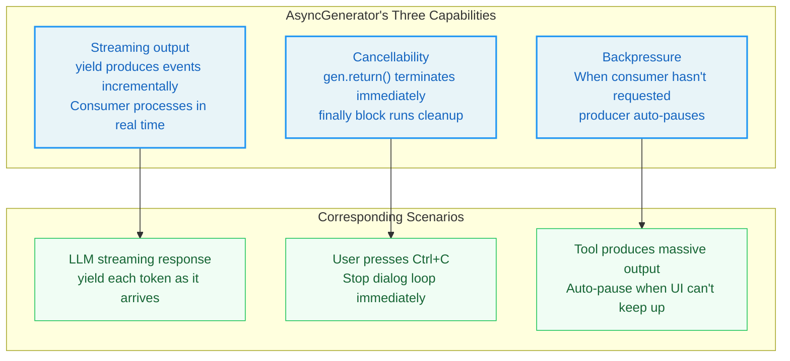
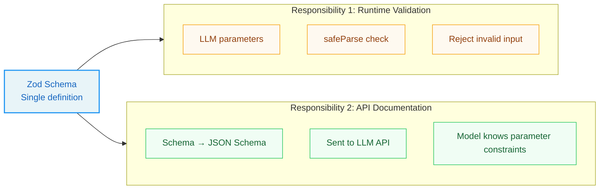
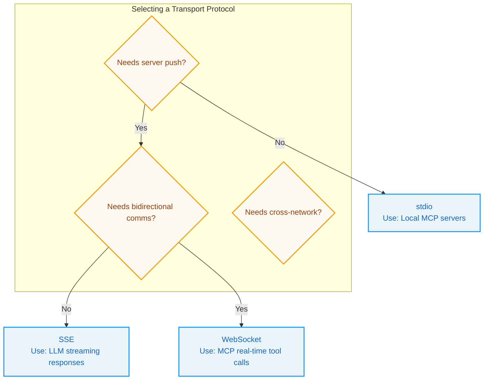
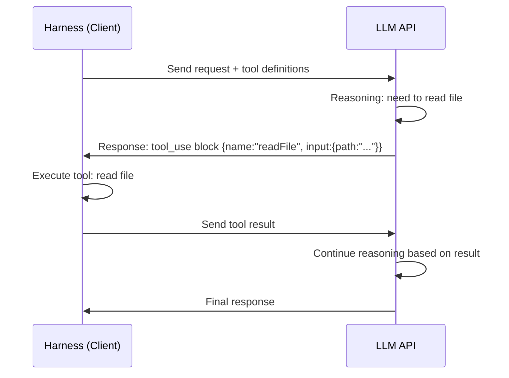

# Chapter 0 Prerequisites

> *"A craftsman must first sharpen his tools."* —The Analerta of Confucius

**Reading guide:** This chapter is the "toolbox" for the entire book. If you are already familiar with TypeScript async programming, Zod validation, the React component model, and HTTP streaming communication, you may skip ahead to Chapter 1. If any of these concepts feel unfamiliar, read the corresponding section first.

This chapter does not aim for completeness — it covers only the knowledge needed to read this book, with each concept explained at "just enough" depth.

---

## 0.1 TypeScript Core Crash Course

Claude Code is written entirely in TypeScript. If you have a background in Java, C#, or Kotlin, TypeScript's type system will feel very familiar. If you have only worked with Python or JavaScript, this section will help you build type-level thinking quickly.

### 0.1.1 Why Types?

In plain JavaScript, variable types are only determined at runtime:

```javascript
function add(a, b) {
  return a + b;
}
add(1, 2);       // 3 — correct
add("1", 2);     // "12" — not an error, but string concatenation!
```

This "discover problems only at runtime" pattern is tolerable in small scripts, but in a 500K-line Agent system it leads to disaster — a type error may manifest as an inexplicable bug thousands of lines away.

TypeScript adds **compile-time type checking** on top of JavaScript:

```typescript
function add(a: number, b: number): number {
  return a + b;
}
add(1, 2);       // ✓ compiles
add("1", 2);     // ✗ compile error: type "string" is not assignable to type "number"
```

Type annotations (`: number`) do not affect runtime performance — the TypeScript compiler checks all type constraints at compile time, then emits pure JavaScript with annotations stripped for execution. Think of TypeScript as "JavaScript + a real-time code reviewer in your editor."

### 0.1.2 Interfaces vs Type Aliases

In Agent systems we need to describe complex data structures — for example, a "tool call request" containing tool name, parameter object, and permission context. TypeScript provides two ways:

**Interface:**

```typescript
interface ToolCall {
  name: string;
  parameters: Record<string, unknown>;
  id: string;
}
```

**Type alias:**

```typescript
type ToolCall = {
  name: string;
  parameters: Record<string, unknown>;
  id: string;
};
```

Both are interchangeable in most scenarios. In this book, Claude Code's codebase primarily uses `type` for data structures and `interface` for contracts that must be implemented.

**Key difference:** `interface` can be `extends`-ed and `implements`-ed, making it suitable for defining "what a class of things must be capable of." `type` is more flexible — it can define union types, mapped types, and other advanced structures, making it suitable for defining "what a class of data looks like."

### 0.1.3 Generics: Parameterized Types

Generics allow you to define "types with parameters" — just as functions accept parameters, types can too:

```typescript
// Without generics: one function per type
function getFirstNumber(arr: number[]): number { return arr[0]; }
function getFirstString(arr: string[]): string { return arr[0]; }

// With generics: one function for all types
function getFirst<T>(arr: T[]): T {
  return arr[0];
}
getFirst([1, 2, 3]);        // return type is number
getFirst(["a", "b"]);       // return type is string
```

In Claude Code, generics are everywhere. The most prominent example is the tool type definition:

```typescript
type Tool<Input, Output, Progress> = {
  name: string;
  inputSchema: ZodSchema<Input>;
  execute(input: Input): Promise<Output>;
  // ...
};
```

The value of generics lies in **type-safe reuse**: the tool orchestration engine does not need to know each tool's concrete types — it only operates on the generic `Tool<I, O, P>` interface.

### 0.1.4 Union Types and Type Guards

A **union type** indicates that a value can be one of several types, separated by `|`:

```typescript
type TerminalReason = 
  | "completed"
  | "aborted_streaming" 
  | "max_turns"
  | "model_error";
```

**Type guards** narrow the type at runtime:

```typescript
type Message = 
  | { type: "user"; content: string }
  | { type: "assistant"; content: string; toolCalls?: ToolCall[] }
  | { type: "system"; notification: string };

function processMessage(msg: Message) {
  switch (msg.type) {
    case "user":
      console.log(msg.content);
      break;
    case "assistant":
      if (msg.toolCalls) {
        handleToolCalls(msg.toolCalls);
      }
      break;
  }
}
```

The TypeScript compiler automatically narrows the type based on the `switch` branch. This "compiler helps you be correct" capability is one of the foundations of Agent system reliability.

---

## 0.2 Async Programming: From Callbacks to Generators

Async programming is the core prerequisite for understanding Claude Code's architecture. The dialog loop, streaming responses, tool execution — nearly every key mechanism is built on async programming.

### 0.2.1 Synchronous vs Asynchronous

Synchronous code executes line by line:

```typescript
const data = readFileSync("config.json");  // blocks until file is read
console.log(data);                          // executes after file is ready
```

If `readFileSync` takes 10 seconds (e.g., reading from a remote server), the entire program does nothing during those 10 seconds — it is "blocked."

In Agent systems, blocking is fatal. An LLM response may take 30 seconds; tool execution may take minutes. Synchronous calls mean a "frozen" terminal.

Async code allows the program to continue doing other things while waiting:

```typescript
readFile("config.json", (err, data) => {
  console.log(data);  // executes when file is ready
});
console.log("continues");  // executes immediately, doesn't wait
```

### 0.2.2 Callback Hell

When multiple async operations must execute sequentially, callbacks nest deeply:

```typescript
readFile("step1.txt", (err, data1) => {
  process(data1, (err, result1) => {
    readFile("step2.txt", (err, data2) => {
      process(data2, (err, result2) => {
        // deep nesting...
      });
    });
  });
});
```

This "pyramid" code is called **Callback Hell**. Its three fatal problems: scattered error handling, complex control flow, and collapsed readability.

### 0.2.3 Promise: Flattening Callbacks with Chaining

A Promise represents an operation that will produce a value in the future:

```typescript
readFileAsync("step1.txt")
  .then(data1 => processAsync(data1))
  .then(result1 => readFileAsync("step2.txt"))
  .then(data2 => processAsync(data2))
  .catch(err => {
    // unified error handling
  });
```

But Promises have a fundamental limitation: they can only **resolve once** — they cannot express "continuously produce multiple values."

### 0.2.4 async/await: Making Async Look Synchronous

`async/await` is syntactic sugar for Promises:

```typescript
async function runSteps() {
  try {
    const data1 = await readFileAsync("step1.txt");
    const result1 = await processAsync(data1);
    const data2 = await readFileAsync("step2.txt");
  } catch (err) {
    // unified error handling
  }
}
```

`await` pauses the current function until the Promise resolves. `try/catch` handles async errors just like synchronous ones.

### 0.2.5 Generator: A Pausable Function

A Generator can **pause and resume**:

```typescript
function* numberGenerator() {
  console.log("start");
  yield 1;           // pause, produce value 1
  console.log("continue");
  yield 2;           // pause, produce value 2
  console.log("end");
  return 3;          // final return value
}

const gen = numberGenerator();
console.log(gen.next()); // prints "start", returns { value: 1, done: false }
console.log(gen.next()); // prints "continue", returns { value: 2, done: false }
console.log(gen.next()); // prints "end", returns { value: 3, done: true }
```

Key features: `yield` pauses execution and produces a value; `gen.next()` resumes to the next `yield`; `gen.return()` terminates the Generator and triggers `finally` blocks.

### 0.2.6 AsyncGenerator: The Perfect Vehicle for Agent Loops

AsyncGenerator is the async version of Generator — `yield`-ed values can be Promises, and `next()` returns Promises:

```typescript
async function* streamTokens() {
  const response = await fetch("https://api.llm.com/stream");
  const reader = response.body!.getReader();
  
  while (true) {
    const { done, value } = await reader.read();
    if (done) break;
    yield value;
  }
}

for await (const chunk of streamTokens()) {
  processChunk(chunk);
}
```

AsyncGenerator simultaneously provides three capabilities — exactly why Claude Code chose it as the dialog loop vehicle:



| Feature | Promise | AsyncGenerator |
|---------|---------|----------------|
| Times values are produced | Once (resolve once) | Multiple (multiple yields) |
| Suitable for | Single async operation | Continuous event stream |
| Cancellation support | Requires AbortController | Built-in `.return()` method |
| Backpressure control | None | Built-in (consumer controls pace) |

> **Key insight:** Claude Code's dialog loop is not a simple "call API → return result" function, but a process that "continuously produces an event stream." AsyncGenerator is the only native JavaScript mechanism that simultaneously expresses "streaming," "cancellable," and "backpressure" semantics.

### 0.2.7 yield* Delegation: Composing Generators

`yield*` allows a Generator to delegate production to another:

```typescript
async function* innerLoop() {
  yield "a";
  yield "b";
}

async function* outerLoop() {
  yield "start";
  yield* innerLoop();  // delegate: innerLoop's output is forwarded
  yield "end";
}
```

In Claude Code, the main dialog loop delegates to tool execution generators via `yield*`, so tool execution events (progress, results) are forwarded directly to the UI layer.

---

## 0.3 Zod: Runtime Type Validation

### 0.3.1 The Boundary of Type Systems

TypeScript's type checking only works at compile time. Once code runs, type annotations disappear — external data (user input, API responses, LLM output) is not checked by TypeScript.

```typescript
interface ToolInput {
  filePath: string;
  encoding?: string;
}

// At runtime: LLM parameters might not match ToolInput at all!
const llmOutput = JSON.parse(llmResponse);
processInput(llmOutput); // compiles, but may crash at runtime
```

This is where **Zod** comes in: it provides runtime type validation.

### 0.3.2 Zod Schema Definition

```typescript
import { z } from "zod";

const ToolInputSchema = z.object({
  filePath: z.string().describe("The file path to read"),
  encoding: z.string().optional().describe("File encoding, defaults to utf-8"),
});

const result = ToolInputSchema.safeParse(llmOutput);
if (result.success) {
  processInput(result.data);
} else {
  console.error("Validation failed:", result.error.issues);
}
```

### 0.3.3 Schema's Dual Responsibility

In Claude Code, Zod Schema serves two critical roles:



**Responsibility 1: Runtime validation.** LLM-generated tool call parameters are parsed by Zod, ensuring type and constraint correctness.

**Responsibility 2: API documentation.** Zod Schema can be converted to JSON Schema format and sent to the LLM API. The `.describe()` text appears directly in the model's tool definition.

This means **type definitions are documentation** — modifying the Schema instantly applies to both runtime validation and API docs, eliminating the classic "code and docs are inconsistent" problem.

---

## 0.4 React and Ink: Component-Based Terminal UI

### 0.4.1 Why Terminal UI Needs Componentization

Traditional terminal programs use `console.log` directly. When the UI becomes complex — progress bars, multi-column layouts, permission dialogs — imperative output becomes unmanageable.

React offers a fundamentally different approach: **declarative rendering**. You describe "what the UI should look like," and the framework calculates "what needs to be updated."

### 0.4.2 React Core Concepts

A React component is a function that accepts data and returns a UI description:

```tsx
function ProgressBar({ percent }: { percent: number }) {
  const filled = "█".repeat(Math.floor(percent / 5));
  const empty = "░".repeat(20 - Math.floor(percent / 5));
  return <Text>{filled}{empty} {percent}%</Text>;
}
```

**State** is data that changes over time inside a component:

```tsx
function DownloadStatus() {
  const [progress, setProgress] = useState(0);
  
  useEffect(() => {
    const timer = setInterval(() => {
      setProgress(prev => Math.min(prev + 10, 100));
    }, 1000);
    return () => clearInterval(timer);
  }, []);

  return <ProgressBar percent={progress} />;
}
```

### 0.4.3 Ink: Running React in the Terminal

[Ink](https://github.com/vadimdemedes/ink) is a framework that renders React components to the terminal. In Claude Code, tool execution progress bars, permission dialogs, and multi-column result displays are all Ink components.

---

## 0.5 Network Communication Basics

### 0.5.1 HTTP Request-Response Model

```
Client → Server: POST /api/messages  { "prompt": "Hello" }
Server → Client: 200 OK  { "response": "Hello! How can I help?" }
```

This is synchronous single interaction — the client waits after sending the request. For simple LLM calls, this suffices. But for Agent scenarios where LLM generation takes 30 seconds, the user sees a blank "loading" interface.

### 0.5.2 SSE (Server-Sent Events)

SSE allows the server to continuously push data to the client through a persistent connection:

```
Client → Server: POST /api/messages  { "prompt": "Hello", "stream": true }
Server → Client: (continuous push)
  data: {"type":"content_block_delta","text":"He"}
  data: {"type":"content_block_delta","text":"llo"}
  data: [DONE]
```

Claude Code's communication with the Anthropic API is based on SSE: the model generates tokens one by one, each pushed to the client as an SSE event, which renders in real-time to the terminal.

### 0.5.3 JSON-RPC: Structured Remote Calls

JSON-RPC is a protocol for remote procedure calls using JSON format:

```json
{"jsonrpc": "2.0", "method": "tools/call", "params": {"name": "readFile", "arguments": {"path": "/tmp/test.txt"}}, "id": 1}
```

Claude Code's MCP (Model Context Protocol) is based on JSON-RPC 2.0. When the Agent calls external tools via MCP, tool calls are encapsulated as JSON-RPC requests.

### 0.5.4 Transport Protocol Selection Matrix



---

## 0.6 LLM API Basics

### 0.6.1 Token: The Currency of LLMs

LLMs process text split into **tokens**. One token is roughly 3/4 of an English word or 1-2 Chinese characters. Token is the basic unit for LLM billing and capacity management.

### 0.6.2 Context Window

Each LLM has a **context window** size limiting the maximum tokens per request. When input tokens approach the window limit, "context compression" is needed — the core topic of Chapter 7.

### 0.6.3 Streaming Responses

Standard API calls wait for the complete response. Streaming calls push results as the model generates token by token — the foundation of Agent system real-time responsiveness.

### 0.6.4 Tool Use

Tool Use is the key protocol enabling LLMs to evolve from "can only speak" to "can act":



> **Why are tool results sent with the `user` role?** Because the Anthropic API has only three message roles: `system`, `user`, `assistant`. Tool results need to be "seen" by the model, so they must be sent as `user` role. This is a case of **engineering constraint driving design decisions**.

---

## 0.7 Development Environment Setup

| Tool | Version | Purpose |
|------|---------|---------|
| Node.js | 18+ | Claude Code runtime dependency |
| npm | 9+ | Package manager |
| Git | 2.30+ | Version control (frequently discussed in permission system) |
| Bun | Latest | Claude Code's actual runtime (faster startup than Node.js) |

```bash
npm install -g @anthropic-ai/claude-code
claude --version
```

---

## Key Takeaways

1. **TypeScript is a compile-time safety net.** Generics, union types, and type guards ensure most type errors are caught at compile time. But external data needs runtime validation.

2. **AsyncGenerator is the best vehicle for Agent loops.** It simultaneously provides streaming output, cancellability, and backpressure control.

3. **Zod bridges compile-time and runtime.** A single Schema definition serves both runtime validation and API documentation.

4. **SSE is the foundation of LLM streaming responses.** Understanding "server continuously pushes small data chunks" is prerequisite for Chapter 15.

5. **Tool Use is the core Agent protocol.** Tool definition → tool_use block → tool_result → multi-round loop — this flow is the technical foundation of Chapters 2-4.
