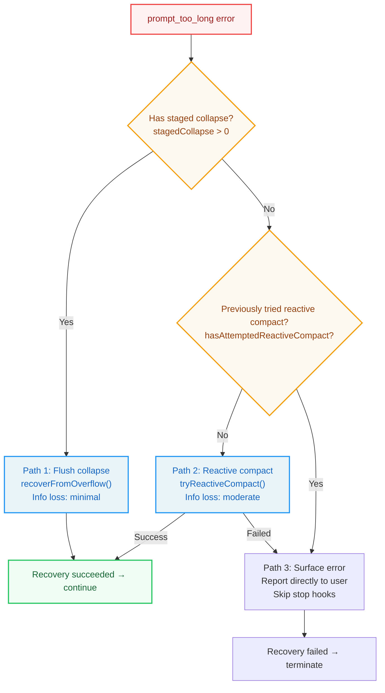
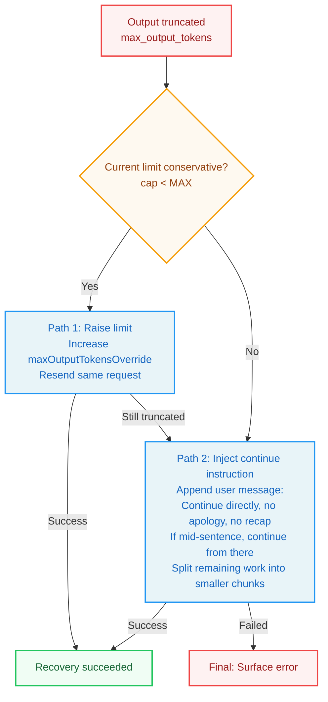
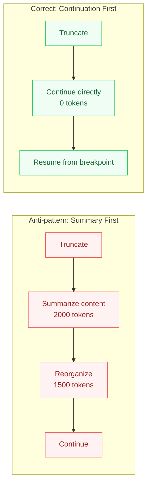
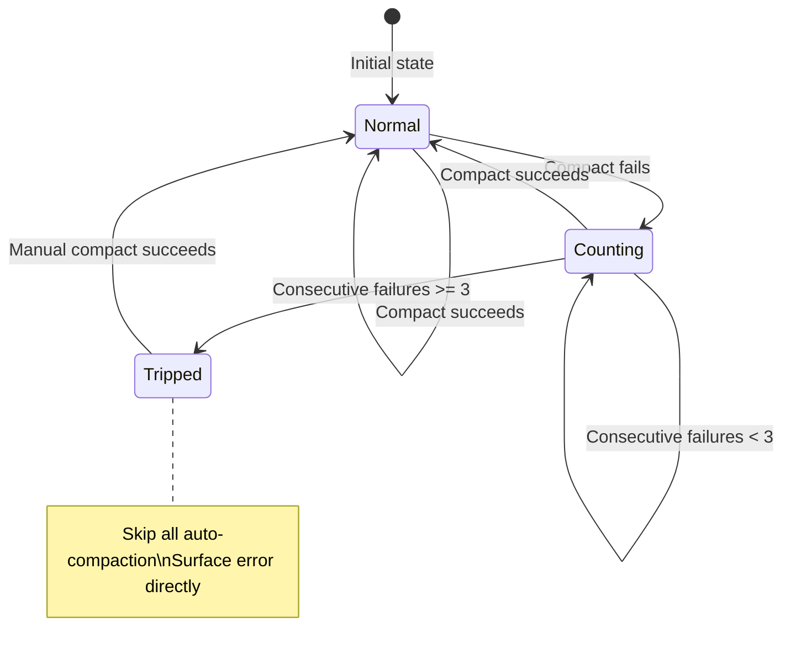

# Chapter 8 Error Recovery: Agent Resilience

> **Learning objectives:** After reading this chapter, you will be able to:
>
> - Understand the design philosophy that "errors are part of the main path, not exceptions"
> - Master the layered recovery strategy for `prompt_too_long` (collapse → reactive compact → surface)
> - Understand the "continuation first" principle for `max_output_tokens` truncation recovery
> - Analyze how circuit breaker patterns prevent recovery mechanisms from becoming infinite loops
> - Master correct interrupt semantics: AbortController and ledger closure
> - Design automated recovery systems that are countable, rate-limited, and breakable

---

## 8.1 The Least Trustworthy Sentence in Engineering: "Under Normal Conditions"

Many system design documents describe only the "happy path" — as if a pretty flow could make errors secondary. Once Agent systems enter real runtime, this breaks fast: models get truncated, requests go too long, hooks create loops, tools get interrupted, fallback paths trigger, and recovery logic itself fails.

A system's maturity cannot be judged by how human-like it sounds when smooth; it must be judged by whether failures still look like system behavior. Claude Code's strength here is not pretending errors are rare. It calmly assumes: **errors are part of the main path, and recovery must be predesigned runtime mechanism.**

> **Design philosophy:** Ordinary assistants follow "answer first, apologize if wrong." Harnesses emphasize "constrain first, execute next"; if errors happen, route through recovery paths rather than improvising. A system that can apologize is not necessarily mature. A system that knows when not to start, when to retry, when to terminate, and how to report failure accurately is closer to maturity.

---

## 8.2 prompt_too_long: Seasonal, Not Exceptional

For long-session agents, `prompt_too_long` is not an edge case — it is a season that eventually arrives.

### 8.2.1 The Withheld Mechanism: Recover First, Report Later

Claude Code does not immediately surface `prompt_too_long` errors to users. Instead, it uses a "withheld" mechanism: certain errors are identified as recoverable and handed to recovery logic first. Only when recovery fails are they surfaced.

| Error Type | Meaning | Recoverability |
|-----------|---------|---------------|
| `prompt_too_long` | Context exceeds model window | High (via compression) |
| `media_size_error` | Image/file too large | Medium (can truncate or remove media) |
| `max_output_tokens` | Model output truncated | High (can raise limit or inject continue instruction) |

### 8.2.2 Layered Recovery: Lightest to Heaviest

When `prompt_too_long` occurs, Claude Code attempts recovery in order of minimum information loss:



**Path 1: Flush staged collapse.** Context Collapse is a low-loss compression strategy. If there are staged but unexecuted collapse operations, flush them first.

**Path 2: Reactive compact.** If no staged collapse exists, trigger full reactive compression — calling the LLM to summarize the historical dialog.

**Path 3: Surface error.** If the above recovery methods are unavailable or have failed, surface the error to the user. Stop hooks are skipped — running stop hooks in an unrecoverable `prompt_too_long` state only leads to death spirals.

### 8.2.3 Anti-Death-Spiral Guards

The most dangerous failure mode of a recovery system is **the recovery logic creating loops itself**:

```
error → hook blocks → retry → error → hook blocks → ...
```

Claude Code prevents this through two mechanisms:

**Guard 1: `hasAttemptedReactiveCompact` flag.** Once reactive compact has been attempted in this turn, same-class failures are not blindly retried.

**Guard 2: Stop hook skipping.** When `prompt_too_long` is unrecoverable, stop hooks are skipped entirely.

> **Anti-pattern warning:** If you're building your own Agent system, ensure recovery logic has clear "exit conditions." A recovery system without exit conditions is like a car without brakes.

---

## 8.3 max_output_tokens Truncation: Continuation Over Summary

### 8.3.1 Two-Stage Recovery Strategy

Claude Code uses a "continuation first" recovery strategy for `max_output_tokens` truncation:



### 8.3.2 Why Continuation Over Summary?

Each post-truncation "summary" burns additional token budget and increases semantic drift. In long tasks, the system ends up spending turns summarizing itself instead of doing the task.



---

## 8.4 Reactive Compact: Recovery Cannot Become Dead-Loop Machinery

### 8.4.1 The Compaction Paradox

If the context is already too large for the model window, the request sent to the LLM for summarization may itself exceed the window — because the summarization request needs to contain the full dialog history.

Claude Code handles this with `truncateHeadForPTLRetry()`: when compaction input is too large, it strips older API rounds in chunks from the head and retries.

This fallback is **lossy** — it may drop history. But its primary goal is **preventing deadlock**: better to restore breathing capacity first, then worry about historical fidelity.

---

## 8.5 Auto-Compact Circuit Breaker

### 8.5.1 The Problem: Infinite Retry of Recovery

A recovery system without limits may attempt doomed API calls every turn:

```
compact fails → retry next turn → compact fails → retry → ...
```

### 8.5.2 Circuit Breaker Mechanism



### 8.5.3 Design Principles

**Any automated recovery must satisfy three conditions:**

1. **Countable:** Record each recovery attempt's outcome
2. **Rate-limited:** Limit recovery attempts per unit time
3. **Breakable:** Stop attempting after consecutive failures reach threshold

A recovery system without brakes is like a vehicle without brakes — it's not recovering, it's accelerating.

---

## 8.6 Interrupt Semantics: Abort Is Also a Failure State

### 8.6.1 Ledger Closure

When the user presses Esc while tools are executing, Claude Code follows the "ledger closure" principle:

1. **Consume remaining results:** Call `StreamingToolExecutor.getRemainingResults()`
2. **Synthesize tool_result:** Create synthetic result messages for issued-but-unfinished tool calls
3. **Close ledger:** Ensure every `tool_use` in message history has a corresponding `tool_result`

This is critical because the next API call sends message history to the model. If there are `tool_use` blocks without `tool_result`, the API returns a protocol error.

> **Key principle:** User abort ≠ recovery failure. The circuit breaker should distinguish "user deliberately stopped" from "system recovery failed."

---

## 8.7 Recovery Path Failure Matrix

| Event | Pre-state | Trigger | Next | Threshold |
|-------|----------|---------|------|-----------|
| PTL → collapse | `stagedCollapse > 0` | `prompt_too_long` | `recoverFromOverflow()` | — |
| PTL → compact | `stagedCollapse = 0` | `prompt_too_long` | `tryReactiveCompact()` | once per turn |
| PTL → surface | `hasAttemptedReactiveCompact` | `prompt_too_long` | Surface directly; skip stop hooks | — |
| Compact PTL | Compact input too long | Inner `prompt_too_long` | `truncateHeadForPTLRetry()` | drop early rounds in chunks |
| MOT → cap↑ | cap < MAX | `max_output_tokens` | Raise `maxOutputTokensOverride` | cap ∈ {conservative, max} |
| MOT → continue | cap = MAX | `max_output_tokens` | Append meta user msg, continue | no recap, no apology |
| Autocompact streak | `consecutiveFailures` ≥ 3 | Next trigger | Skip compact, surface | `MAX_CONSECUTIVE_AUTOCOMPACT_FAILURES = 3` |
| User abort | Streaming with pending `tool_use` | Esc | Consume remaining + synthetic `tool_result` | Ledger must close |

---

## 8.8 Circuit Breaker Invariants

```typescript
assert withheld_error ∈ {prompt_too_long, media_size, max_output_tokens}
assert hasAttemptedReactiveCompact ⇒ skip further reactive compact
assert consecutiveFailures < MAX_CONSECUTIVE_AUTOCOMPACT_FAILURES
assert compact_aborted_by_user ≠ summary_success
assert every withheld_recoverable_error surfaces iff recovery exhausted
```

### 8.5.4 Implementation Reference: Exponential Backoff Retry

Retry on API call failure is the foundation of any recovery system. Here is the pattern Claude Code uses:

```typescript
function isRetryable(error: any): boolean {
  const status = error?.status || error?.statusCode;
  if ([429, 503, 529].includes(status)) return true;  // rate-limit / overload
  if (error?.code === "ECONNRESET" || error?.code === "ETIMEDOUT") return true;
  if (error?.message?.includes("overloaded")) return true;
  return false;
}

async function withRetry<T>(
  fn: (signal?: AbortSignal) => Promise<T>,
  signal?: AbortSignal,
  maxRetries = 3
): Promise<T> {
  for (let attempt = 0; ; attempt++) {
    try {
      return await fn(signal);
    } catch (error: any) {
      if (signal?.aborted) throw error;        // user abort → don't retry
      if (attempt >= maxRetries || !isRetryable(error)) throw error;
      // Exponential backoff + random jitter to avoid thundering herd
      const delay = Math.min(1000 * Math.pow(2, attempt), 30000)
                    + Math.random() * 1000;
      await new Promise((r) => setTimeout(r, delay));
    }
  }
}
```

Key design points:
- **Retryable judgment:** Only retry rate-limiting (429), service unavailable (503), overload (529), and network errors — never retry client errors (4xx)
- **Exponential backoff:** `1000ms → 2000ms → 4000ms`, capped at 30 seconds
- **Random jitter:** `+ Math.random() * 1000` prevents multiple clients from retrying simultaneously (thundering herd)
- **Abort awareness:** `signal?.aborted` check ensures Ctrl+C stops retries immediately

---

## Key Takeaways

1. **Errors are part of the main path.** `prompt_too_long` and `max_output_tokens` are structural norms for long-session agents.

2. **Recovery must be layered.** From flush collapse → reactive compact → surface error, each step tries the lowest-cost approach.

3. **Recovery systems need governance.** Circuit breakers ensure recovery won't consume infinite resources on repeated failure.

4. **Continuation over summary.** After truncation, inject continue instructions rather than summary requests.

5. **Interrupts need semantic closure.** Ledger closure ensures message history protocol integrity after abort.

6. **Recovery preserves narrative consistency.** Good error handling lets the system explain what it went through.
