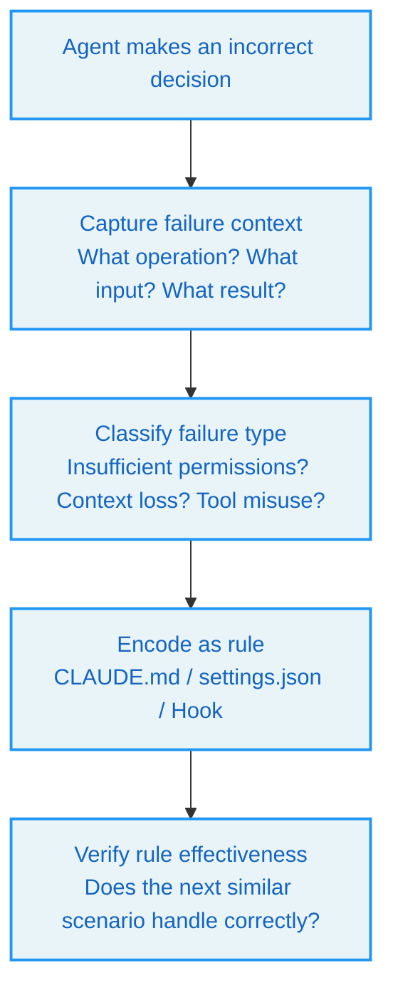
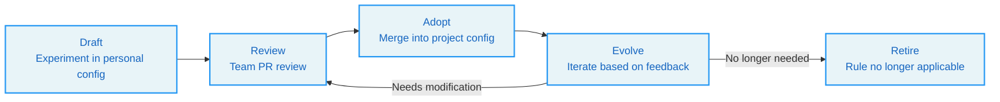

# Chapter 18 Team Adoption -- From Tools to Institutions

> **Learning Objectives:** After reading this chapter, you will be able to:
>
> - Identify three typical team profiles and their primary tensions
> - Master methods for codifying individual experience into reusable institutional practices
> - Understand the design philosophy of CLAUDE.md / AGENTS.md as carriers of team institutions
> - Design a phased roadmap for Agent system adoption
> - Evaluate the tradeoff between "runtime flexibility" and "institutionalized explicitness"

---

## 18.1 The Team Dilemma of Agent Systems

A developer uses Claude Code in personal projects with excellent results -- they understand the characteristics of each tool, know when to trust the Agent and when to intervene, and have accumulated extensive tacit experience.

Then they bring Claude Code into the team.

One week later, problems emerge:

- Junior developers don't know which operations require human confirmation and accidentally delete production configurations
- Someone configured overly permissive permission rules in `.claude/settings.json`, which others inadvertently inherited
- No one can clearly articulate "what rules our Agent should follow" -- rules are scattered across personal configurations, project READMEs, and oral traditions
- When the Agent makes an incorrect decision, there is no mechanism for the team to learn from the failure

The root cause of these problems is not technical -- it is **institutional**. Individual experience has not been converted into team rules, the Agent's behavioral boundaries have not been explicitly defined, and failures have not been encoded as protective mechanisms.

> **Core Insight:** A team's maturity in using Agents is not determined by how skilled the strongest member is, but by how far the weakest member can go without verbal guidance.

---

## 18.2 Three Team Profiles

### Profile One: Runaway Prototypes

**Characteristics:** The team already has an Agent prototype, but long-running sessions frequently spiral out of control.

**Typical Symptoms:**
- Context becomes increasingly noisy over time
- Tool call chains break
- State is unclear after interruptions
- No one can cleanly shut down subagent work
- Verification degenerates into verbal promises

**Primary Tension:** The system cannot stay alive long enough. The issue is not "the control plane is incomplete" but "the system cannot remain stable for a sufficiently long duration."

**Priority Learning:** Runtime discipline in Claude Code -- state management of the query loop, context governance, tool orchestration, interrupt handling, subagent lifecycle.

**Entry Recommendation:** Stabilize the loop first, then discuss institutions. Institutional aesthetics can wait.

### Profile Two: Scattered Rules

**Characteristics:** The team already has many rules, but rule sources are fragmented and permission boundaries are unclear.

**Typical Symptoms:**
- Local rules are scattered everywhere
- No one can articulate which constraints are in prompts and which are in tools
- Approval logic is mixed into code, making it hard to explain
- After introducing multiple extensions, boundaries become even more blurred

**Primary Tension:** The system becomes increasingly difficult to govern. The issue is not "the system cannot function on-site" but "the system becomes harder and harder to manage."

**Priority Learning:** The explicit control layer -- turning instructions, tools, policies, and threads into explicit concepts.

**Entry Recommendation:** Make rules explicit first, then discuss runtime optimization.

### Profile Three: Starting from Scratch

**Characteristics:** No mature Agent system exists; the team is starting from zero.

**This is the most dangerous situation.** The easiest mistake to make is simultaneously envying the advantages of both systems and building a failed compromise.

**A more stable approach:**
1. Choose a primary tension
2. Design the skeleton around the primary tension
3. Keep the opposite side at minimum viable level only

If the first phase's primary risk is "model behavior going out of control," start with runtime discipline in the Claude Code sense. If the first phase's primary risk is "the team losing institutional order," start with the explicit control layer.

**The worst move** is trying to fully learn both sides simultaneously, ending up with neither a stable main loop nor a clear control plane.

---

## 18.3 Phased Builder Checklists

### Type One: Prototype Exists, Long Sessions Out of Control (Prioritize Claude Code)

```
Week 1:
  □ Name the loop state set: {messages, toolUseContext, compactTracking, turnCount}
  □ Ensure every tool_use is closed or synthetically padded; abort paths are connected
Week 2:
  □ Context governance trio -- memory / folding / auto-compaction threshold frozen in config table
  □ Verification independent of implementation (verifier ≠ implementer)
Week 3:
  □ Subagent lifecycle SubagentStart/Stop observable
Pass criteria: 24-hour continuous session with no token breaker trips, no orphan subagents, no tool_result leaks
```

### Type Two: Rules Multiplying, Sources Scattered, Boundaries Unclear (Prioritize Codex)

```
Week 1:
  □ All instructions become fragments -- tag, source, and priority declared for each
  □ Tool usage schemas typed, additional_properties=false
Week 2:
  □ Approval policies elevated to rules -- deny/ask/allow independently evaluable
  □ thread.id / rollout established; turn-level {approvalPolicy, sandboxMode} explicit
Week 3:
  □ Hooks split into pre/post/session_start/stop
  □ Skill assets installed via fingerprint
Pass criteria: Any rule change lands via PR diff, no runtime code modification required
```

### Type Three: Starting from Scratch (Choose Primary Tension First)

```
Week 1:
  □ Declare the primary tension -- "model out of control" vs. "team out of order"
  □ Define minimum permission model (deny/ask list for high-risk operations)
Week 2:
  □ Build the skeleton on the primary tension side (loop OR fragments+threads, pick one)
Week 3:
  □ Keep the opposite side at minimum viable only (recovery path OR basic hooks)
Week 4:
  □ Land 1-2 skills/tools; prove the loop closes end-to-end
Pass criteria: New team members can independently advance through the checklist without the original author's verbal coaching
```

---

## 18.4 CLAUDE.md and AGENTS.md: Carriers of Institutions

### CLAUDE.md: The Local Bulletin Board

`CLAUDE.md` is Claude Code's local rules file. It lives in the project root directory, paired with memory and skills, and is suitable for registering common knowledge, prohibitions, and local rules.

```
# CLAUDE.md Example

## Project Rules
- Use TypeScript strict mode
- All API endpoints must have input validation
- Test coverage must not fall below 80%

## Prohibited Operations
- Do not modify the main branch directly
- Do not run `npm publish`
- Do not modify .env files

## Code Style
- Use 2-space indentation
- Prefer const over let
- Functions must not exceed 50 lines
```

The design philosophy of `CLAUDE.md` is the "proximity principle" -- rules closer to the task directory take higher priority. This ensures different projects can have different rules, with global rules serving as a fallback.

### AGENTS.md: Institutionalized Expression

`AGENTS.md` is the rules carrier in the Codex ecosystem. Unlike the "bulletin board" style of `CLAUDE.md`, `AGENTS.md` emphasizes **inheritability** and **explicit scoping** of rules -- even without an `AGENTS.md`, enabling `child_agents_md` appends scope and priority annotations.

| Characteristic | CLAUDE.md | AGENTS.md |
|------|-----------|-----------|
| Style | Local bulletin board | Institutionalized document |
| Focus | Registering common knowledge and prohibitions | Rule applicability and inheritance |
| Memory pairing | Paired with memdir | Paired with thread/rollout |
| Best for | Teams with rapid iteration | Teams needing clear governance boundaries |

### Selection Guidance

**Choose CLAUDE.md if:**
- Team is small (< 10 people)
- Project iteration speed is high
- Rules change frequently and require rapid response
- Flexibility is valued over explicitness

**Choose the AGENTS.md style if:**
- Team is larger
- Multiple projects need to share rules
- Clear rule inheritance and override mechanisms are needed
- Governance boundaries are valued over flexibility

---

## 18.5 How Individual Experience Becomes Institutional

### Failure Encoding

When the Agent makes an incorrect decision, the team should have a mechanism to learn from the failure:



**Example:** The Agent deleted an important file without confirmation.

1. **Capture:** The Agent used FileDeleteTool with permission mode set to auto
2. **Classification:** Permission configuration was overly permissive
3. **Encoding:** Add FileDeleteTool to the deny list in `settings.json`, or configure a PreToolUse Hook to require confirmation
4. **Verify:** The next time the Agent attempts to delete a file, does it correctly trigger the confirmation flow

### Success Encoding

Similarly, successful experiences should also be codified:

**Example:** When handling a large refactoring, the Agent first reads all relevant files before starting edits, with excellent results.

1. **Capture:** The Agent's behavioral pattern
2. **Encoding:** Add a rule to CLAUDE.md: "Before performing code refactoring, read all relevant files first"
3. **Propagation:** All team projects share this rule

### Rule Lifecycle



---

## 18.6 Runtime Flexibility vs. Institutionalized Explicitness

Many system builders rely on a lazy false dichotomy:

- When they hear "explicit control layer," they imagine a heavy, slow, rigid system
- When they hear "runtime flexibility," they imagine experience can hold things together for now, and structure can come later

Neither is wise. Explicitness is not inherently rigid, and flexibility is not inherently chaotic. The real question is: **Have you clearly defined what must be explicit and what can be left to on-the-spot judgment?**

Claude Code's strength is not rejecting structure, but knowing which problems must be confronted at runtime. Codex's strength is not rejecting flexibility, but knowing which boundaries, if not declared early, will become endless debates.

A good third-party system does not take the average of the two -- it distinguishes:
- Which rules must be written down first
- Which judgments can remain at runtime
- Which state must be persisted
- Which experience only needs to live in session memory

> **The Dangerous Third Path:** Many young systems fail at both. They neither harden runtime discipline nor make the control layer truly explicit. Instead, they take a third path that appears easier: continuously stuffing more guidance files, role descriptions, skill descriptions, and workspace text into the prompt, hoping that richness of information can compensate for the fragility of the skeleton. Viable in the short term, it inevitably exposes a dual failure in the long run: tokens burn fast, and working semantics remain unstable.

---

## 18.7 The Practical Path from Individual to Team

### Phase One: Individual Experimentation (1-2 Weeks)

- Use the Agent in personal projects to accumulate tacit experience
- Document "what works, what doesn't"
- Identify high-risk operations and common failure modes

### Phase Two: Rule Extraction (1 Week)

- Extract reusable rules from individual experience
- Write the initial CLAUDE.md / settings.json
- Configure basic permission rules and hooks

### Phase Three: Team Trial (2-4 Weeks)

- Select a low-risk project for a team trial
- Collect feedback from team members
- Iterate on rule configurations

### Phase Four: Institutionalization (Ongoing)

- Establish a rule review process (PR review)
- Define rule lifecycle management
- Build mechanisms for failure encoding and success encoding
- Regularly review and optimize rules

---

## Key Takeaways

1. **Team Agent maturity depends on the weakest link.** Not how skilled the strongest person is, but how far the weakest person can go without verbal guidance.

2. **Identify the primary tension first.** "Long sessions out of control" and "scattered rules" are fundamentally different problems requiring different entry points.

3. **Rules need carriers.** CLAUDE.md is a bulletin board for rapid iteration; AGENTS.md is an institutionalized document. The choice depends on team size and governance needs.

4. **Both failures and successes should be encoded.** The mechanism for learning from errors (failure encoding) and codifying best practices (success encoding) are equally important.

5. **Avoid the trap of "rich information compensating for fragile skeletons."** Continuously stuffing content into prompts is not institutionalization -- it is information overload.

6. **Advance in phases.** Individual experimentation → Rule extraction → Team trial → Institutionalization. Each phase has clear exit criteria.
