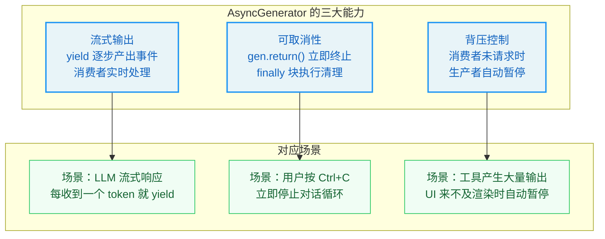
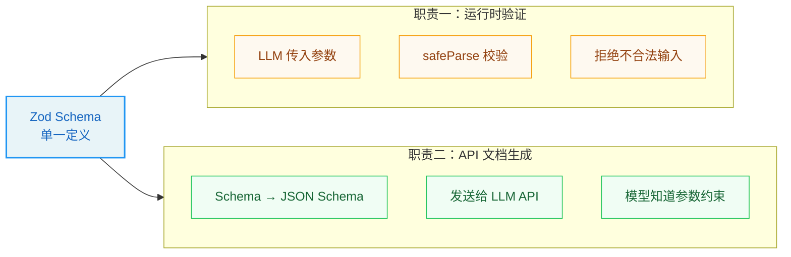
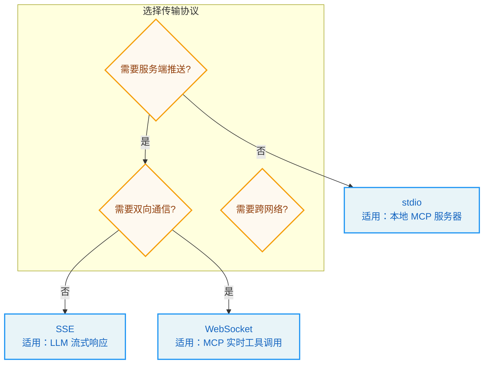
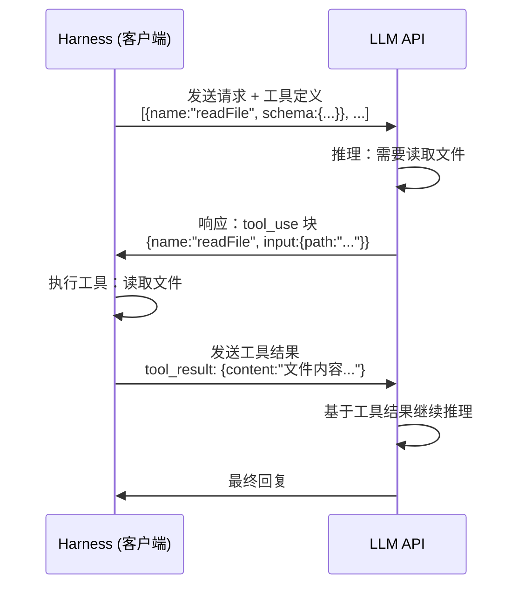

# 第 0 章 预备知识

> *"工欲善其事，必先利其器。"* ——《论语·卫灵公》

**阅读指南：** 本章是全书的"工具箱"。如果你已经熟悉 TypeScript 异步编程、Zod 验证、React 组件模型和 HTTP 流式通信，可以跳过本章直接进入第 1 章。如果你对其中某些概念感到陌生，建议先阅读对应小节，再进入正文。

本章不追求面面俱到——它只覆盖阅读本书所必需的知识点，每个概念都以"够用即可"为原则，避免过度展开。

---

## 0.1 TypeScript 核心速修

Claude Code 完全使用 TypeScript 编写。如果你有 Java、C# 或 Kotlin 的基础，TypeScript 的类型系统会非常熟悉。如果你只接触过 Python 或 JavaScript，这一节会帮你快速建立类型思维。

### 0.1.1 为什么需要类型？

在纯 JavaScript 中，变量的类型在运行时才确定：

```javascript
function add(a, b) {
  return a + b;
}
add(1, 2);       // 3 — 正确
add("1", 2);     // "12" — 不是错误，而是字符串拼接！
```

这种"运行时才发现问题"的模式在小型脚本中尚可接受，但在 50 万行代码的 Agent 系统中会导致灾难——一个类型错误可能在数万行之外才表现为不可解释的 bug。

TypeScript 在 JavaScript 的基础上增加了**编译时类型检查**：

```typescript
function add(a: number, b: number): number {
  return a + b;
}
add(1, 2);       // ✓ 编译通过
add("1", 2);     // ✗ 编译报错：类型"string"不能赋值给类型"number"
```

类型标注（`: number`）不会影响运行时性能——TypeScript 编译器会在编译阶段检查所有类型约束，然后生成去掉类型标注的纯 JavaScript 代码供运行时执行。你可以把 TypeScript 理解为"JavaScript + 编辑器里的实时代码审查员"。

### 0.1.2 接口与类型别名

在 Agent 系统中，我们需要描述复杂的数据结构——比如一个"工具调用请求"包含工具名称、参数对象、权限上下文等字段。TypeScript 提供两种方式来定义这类结构：

**接口（interface）**：

```typescript
interface ToolCall {
  name: string;
  parameters: Record<string, unknown>;
  id: string;
}
```

**类型别名（type）**：

```typescript
type ToolCall = {
  name: string;
  parameters: Record<string, unknown>;
  id: string;
};
```

两者在大多数场景下可以互换。本书中，Claude Code 的代码库主要使用 `type` 来定义数据结构，使用 `interface` 来定义需要被实现的契约（如工具必须遵循的协议）。

**关键区别：** `interface` 可以被 `extends`（继承）和 `implements`（实现），适合定义"某类事物必须具备的能力"；`type` 更灵活，可以定义联合类型、映射类型等高级结构，适合定义"某类数据长什么样"。

### 0.1.3 泛型：类型的参数化

泛型是 TypeScript 最强大的特性之一。它允许你定义"带参数的类型"——就像函数接受参数一样，类型也可以接受参数。

一个简单的例子：

```typescript
// 没有泛型：需要为每种类型写一个函数
function getFirstNumber(arr: number[]): number { return arr[0]; }
function getFirstString(arr: string[]): string { return arr[0]; }

// 有泛型：一个函数适用于所有类型
function getFirst<T>(arr: T[]): T {
  return arr[0];
}
getFirst([1, 2, 3]);        // 返回类型是 number
getFirst(["a", "b"]);       // 返回类型是 string
```

在 Claude Code 中，泛型无处不在。最典型的例子是工具类型定义：

```typescript
type Tool<Input, Output, Progress> = {
  name: string;
  inputSchema: ZodSchema<Input>;
  execute(input: Input): Promise<Output>;
  // ...
};
```

这里的 `Input`、`Output`、`Progress` 就是泛型参数。当你定义一个具体的工具时，需要指定这三个参数的实际类型：

```typescript
type ReadTool = Tool<
  { filePath: string },           // Input：输入参数的形状
  { content: string },            // Output：输出结果的形状
  { bytesRead: number }           // Progress：进度报告的形状
>;
```

泛型的价值在于**类型安全的复用**：工具系统的编排引擎不需要知道每个工具的具体类型，它只需要操作泛型的 `Tool<I, O, P>` 接口——校验输入、调用执行、收集输出。具体类型由每个工具自己定义。

### 0.1.4 联合类型与类型守卫

**联合类型** 表示一个值可以是多种类型之一，用 `|` 分隔：

```typescript
type TerminalReason = 
  | "completed"
  | "aborted_streaming" 
  | "max_turns"
  | "model_error";
```

这在 Agent 系统中极为常见——对话循环的终止原因、工具调用的权限决策、消息的类型标识，都是联合类型。

**类型守卫** 是一种在运行时缩小类型范围的机制：

```typescript
type Message = 
  | { type: "user"; content: string }
  | { type: "assistant"; content: string; toolCalls?: ToolCall[] }
  | { type: "system"; notification: string };

function processMessage(msg: Message) {
  switch (msg.type) {
    case "user":
      // TypeScript 知道这里 msg 一定是 { type: "user"; content: string }
      console.log(msg.content);
      break;
    case "assistant":
      // 这里 msg 一定是 { type: "assistant"; ... }
      if (msg.toolCalls) {
        // 进一步收窄：msg.toolCalls 一定存在
        handleToolCalls(msg.toolCalls);
      }
      break;
  }
}
```

TypeScript 编译器会根据 `switch` 分支自动收窄类型——在 `case "user"` 分支中，你只能访问 `content` 属性，不能访问 `toolCalls`，因为编译器知道此时 `msg` 的类型不包含 `toolCalls`。这种"编译器帮你做正确性检查"的能力，是 Agent 系统可靠性的基石之一。

### 0.1.5 异步类型：Promise 与 AsyncGenerator

TypeScript 的类型系统可以精确描述异步操作的返回类型：

```typescript
// Promise<T>：将来会产生的值
async function fetchUser(): Promise<User> {
  const response = await fetch("/api/user");
  return response.json();
}

// AsyncGenerator<Y, R, N>：逐步产出的值流
async function* countUp(): AsyncGenerator<number, string, void> {
  yield 1;   // 产出数字 1
  yield 2;   // 产出数字 2
  yield 3;   // 产出数字 3
  return "done"; // 最终返回值
}
```

这两个类型是理解 Claude Code 对话循环的关键——`Promise` 用于单次异步操作（如一次 API 调用），`AsyncGenerator` 用于持续的事件流（如整个对话过程）。我们将在下一节深入讲解异步编程的演进。

---

## 0.2 异步编程：从回调到生成器

异步编程是理解 Claude Code 架构的核心前提。对话循环、流式响应、工具执行——几乎所有关键机制都建立在异步编程之上。这一节将带你从最基础的回调模式一路走到 AsyncGenerator，理解每一步演进的动机。

### 0.2.1 同步 vs 异步：为什么需要异步？

同步代码按照书写顺序逐行执行：

```typescript
const data = readFileSync("config.json");  // 阻塞，等待文件读完
console.log(data);                          // 文件读完后才执行
console.log("继续");                        // 上一行完成后才执行
```

这在读取小文件时没有问题。但如果 `readFileSync` 需要 10 秒（比如从远程服务器读取），整个程序在这 10 秒内什么都做不了——它被"阻塞"了。

在 Agent 系统中，阻塞是致命的。LLM 的一次响应可能需要 30 秒，期间用户需要看到实时的思考过程；工具执行可能需要数分钟，期间需要展示进度条。如果使用同步调用，用户面对的就是一个"卡死"的终端。

异步代码允许程序在等待操作完成时继续做其他事情：

```typescript
// 异步版本：发起操作后立即返回，不阻塞
readFile("config.json", (err, data) => {
  console.log(data);  // 文件读完后执行
});
console.log("继续");  // 不等文件读完，立即执行
```

输出顺序是："继续"先于文件内容被打印。这就是异步的核心思想：**发起操作，注册回调，继续执行其他任务，操作完成时回调被调用。**

### 0.2.2 回调地狱：异步的第一次危机

当多个异步操作需要按顺序执行时，回调模式会导致代码深度嵌套：

```typescript
readFile("step1.txt", (err, data1) => {
  process(data1, (err, result1) => {
    readFile("step2.txt", (err, data2) => {
      process(data2, (err, result2) => {
        readFile("step3.txt", (err, data3) => {
          // 终于到了最内层...
          // 错误处理在哪里？每层都要检查 err
        });
      });
    });
  });
});
```

这种"金字塔形"代码被称为**回调地狱**（Callback Hell）。它有三个致命问题：

1. **错误处理分散**：每一层都需要单独检查错误，遗漏任何一层都会导致静默失败。
2. **控制流复杂**：想在第二步和第三步之间加入并行操作极其困难。
3. **可读性崩溃**：代码的缩进层级代表的是嵌套深度，而非逻辑层次。

### 0.2.3 Promise：用链式调用扁平化回调

Promise 是 JavaScript 对回调地狱的第一次系统性回应。一个 Promise 代表一个"将来会产生值"的操作：

```typescript
const promise = readFileAsync("config.json");
// promise 现在处于"等待中"（pending）状态
// 文件读完后变为"已完成"（fulfilled），携带文件内容
// 读取出错时变为"已拒绝"（rejected），携带错误信息
```

Promise 的核心能力是**链式调用**——用 `.then()` 串联多个异步操作：

```typescript
readFileAsync("step1.txt")
  .then(data1 => processAsync(data1))
  .then(result1 => readFileAsync("step2.txt"))
  .then(data2 => processAsync(data2))
  .then(result2 => readFileAsync("step3.txt"))
  .then(data3 => {
    // 所有步骤完成
  })
  .catch(err => {
    // 统一的错误处理：任何一步出错都会到这里
  });
```

金字塔变成了扁平的链条，错误处理统一到了一个 `.catch()` 中。但 Promise 有一个根本局限：**它是"一次性"的**——一个 Promise 只能 resolve 一次，无法表达"持续产出多个值"的场景。

### 0.2.4 async/await：让异步代码看起来像同步

`async/await` 是 Promise 的语法糖，让异步代码拥有同步代码的书写体验：

```typescript
async function runSteps() {
  try {
    const data1 = await readFileAsync("step1.txt");
    const result1 = await processAsync(data1);
    const data2 = await readFileAsync("step2.txt");
    const result2 = await processAsync(data2);
    const data3 = await readFileAsync("step3.txt");
    // 所有步骤完成
  } catch (err) {
    // 统一的错误处理
  }
}
```

`await` 关键字暂停当前函数的执行，等待 Promise 完成后继续。`try/catch` 可以像处理同步错误一样处理异步错误。代码的可读性回到了同步风格，但运行时行为仍然是异步的——`await` 不会阻塞整个程序，只暂停当前 `async` 函数。

### 0.2.5 Generator：可暂停的函数

在进入 AsyncGenerator 之前，先理解普通 Generator。Generator 是一种可以**暂停和恢复**的函数：

```typescript
function* numberGenerator() {
  console.log("开始");
  yield 1;           // 暂停，产出值 1
  console.log("继续");
  yield 2;           // 暂停，产出值 2
  console.log("结束");
  return 3;          // 最终返回值
}

const gen = numberGenerator();
console.log(gen.next()); // 打印"开始"，返回 { value: 1, done: false }
console.log(gen.next()); // 打印"继续"，返回 { value: 2, done: false }
console.log(gen.next()); // 打印"结束"，返回 { value: 3, done: true }
```

关键特性：

- `function*` 声明一个 Generator 函数
- `yield` 暂停执行并产出一个值给调用者
- `gen.next()` 恢复执行到下一个 `yield`
- Generator 可以被外部代码随时终止：`gen.return()` 立即结束 Generator 并执行 `finally` 块

用一个比喻来理解：普通函数像一个自动售货机——投币后一次性吐出商品。Generator 像一个扭蛋机——每扭一次出一个球，你可以决定何时停止扭动。

### 0.2.6 AsyncGenerator：Agent 循环的完美载体

AsyncGenerator 是 Generator 的异步版本——`yield` 的值可以是 Promise，`next()` 返回的也是 Promise：

```typescript
async function* streamTokens() {
  const response = await fetch("https://api.llm.com/stream");
  const reader = response.body!.getReader();
  
  while (true) {
    const { done, value } = await reader.read();
    if (done) break;
    yield value;  // 每收到一块数据就 yield 出去
  }
}

// 消费端：for await...of 自动处理异步迭代
for await (const chunk of streamTokens()) {
  processChunk(chunk);  // 实时处理每个数据块
}
```

AsyncGenerator 同时具备三个关键能力——这正是 Claude Code 选择它作为对话循环载体的原因：



**为什么 Promise 和 async/await 不够？**

| 特性 | Promise | AsyncGenerator |
|------|---------|----------------|
| 产出值的次数 | 一次（resolve 一次） | 多次（多次 yield） |
| 适合场景 | 单次异步操作 | 持续事件流 |
| 取消支持 | 需要 AbortController | 内置 `.return()` 方法 |
| 背压控制 | 无 | 内置（消费者控制节奏） |
| Claude Code 中的用途 | 单次 API 调用 | 整个对话循环 |

> **关键洞察：** Claude Code 的对话循环不是一个"调用 API → 返回结果"的简单函数，而是一个"持续产出事件流"的过程——思考过程、工具调用、执行进度、最终回复，都是逐步产出的。AsyncGenerator 是 JavaScript 中唯一能同时表达"流式"、"可取消"和"背压"三种语义的原生机制。

### 0.2.7 yield* 委托：生成器的组合

`yield*` 允许一个 Generator 将产出委托给另一个 Generator：

```typescript
async function* innerLoop() {
  yield "a";
  yield "b";
}

async function* outerLoop() {
  yield "start";
  yield* innerLoop();  // 委托：innerLoop 的产出被转发给 outerLoop 的消费者
  yield "end";
}

for await (const v of outerLoop()) {
  console.log(v); // 依次打印: "start", "a", "b", "end"
}
```

在 Claude Code 中，对话主循环通过 `yield*` 委托给工具执行生成器，使得工具执行的事件（进度、结果）被直接转发给 UI 层——上层代码只需要一个 `for await...of` 循环就能消费所有层次的事件。

---

## 0.3 Zod：运行时类型验证

### 0.3.1 类型系统的边界

TypeScript 的类型检查只在编译时有效。一旦代码运行起来，类型标注就消失了——来自外部的数据（用户输入、API 响应、LLM 输出）不会被 TypeScript 检查。

```typescript
interface ToolInput {
  filePath: string;
  encoding?: string;
}

// 编译时：TypeScript 保证这个函数内部的类型正确
function processInput(input: ToolInput) { ... }

// 运行时：LLM 传来的参数可能完全不符合 ToolInput 的定义！
const llmOutput = JSON.parse(llmResponse); // 可能是任何东西
processInput(llmOutput); // 编译通过，但运行时可能崩溃
```

这就是 **Zod** 存在的意义：它在运行时提供类型验证，确保外部数据真正符合预期的结构。

### 0.3.2 Zod Schema 定义

Zod 使用链式 API 定义数据的"形状"：

```typescript
import { z } from "zod";

// 定义 Schema
const ToolInputSchema = z.object({
  filePath: z.string().describe("要读取的文件路径"),
  encoding: z.string().optional().describe("文件编码，默认为 utf-8"),
});

// 运行时验证
const result = ToolInputSchema.safeParse(llmOutput);
if (result.success) {
  // result.data 的类型被自动推导为 { filePath: string; encoding?: string }
  processInput(result.data);
} else {
  // result.error 包含详细的验证错误信息
  console.error("参数验证失败:", result.error.issues);
}
```

Zod 的核心方法有两个：

| 方法 | 行为 | 适用场景 |
|------|------|---------|
| `.parse(data)` | 验证通过返回数据，失败抛出异常 | 确信数据一定合法时 |
| `.safeParse(data)` | 返回 `{ success, data/error }` 结果对象 | 需要优雅处理验证失败时 |

在 Agent 系统中，我们总是使用 `safeParse`——因为 LLM 的输出是不可预测的，验证失败是正常情况而非异常。

### 0.3.3 Schema 的双重职责

在 Claude Code 中，Zod Schema 承担了两个关键职责：



**职责一：运行时验证。** LLM 生成的工具调用参数经过 Zod 解析，确保类型和约束的正确性。这是"不信任外部输入"原则的体现。

**职责二：API 文档生成。** Zod Schema 可以转换为 JSON Schema 格式，发送给 LLM API。模型看到每个参数的名称、类型和描述后，才能生成符合要求的工具调用参数。`z.string().describe("文件路径")` 中的 `.describe()` 文本会直接出现在模型的工具定义中。

这意味着**类型定义就是文档**——修改 Schema 即时生效于运行时验证和 API 文档，消除了"代码和文档不一致"的经典问题。

---

## 0.4 React 与 Ink：终端中的组件化 UI

### 0.4.1 为什么终端 UI 需要组件化？

传统的终端程序使用 `console.log` 直接输出文本：

```javascript
console.log("正在读取文件...");
console.log(`进度: ${progress}%`);
console.log("完成！");
```

这种方式在简单场景下工作良好，但当 UI 变得复杂时——进度条、多列布局、权限确认对话框、工具执行状态面板——命令式的逐行输出会变成一团乱麻。你需要手动管理光标位置、处理屏幕刷新、协调多个并行更新。

React 提供了一种完全不同的思路：**声明式渲染**。你只需要描述"UI 应该长什么样"，框架负责计算"需要更新哪些部分"。

### 0.4.2 React 核心概念：组件与状态

一个 React 组件是一个接受数据、返回 UI 描述的函数：

```tsx
function ProgressBar({ percent }: { percent: number }) {
  const filled = "█".repeat(Math.floor(percent / 5));
  const empty = "░".repeat(20 - Math.floor(percent / 5));
  return <Text>{filled}{empty} {percent}%</Text>;
}
```

当 `percent` 变化时，React 自动重新调用这个函数并更新终端中对应的区域——你不需要手动管理"之前画了什么、现在需要改什么"。

**状态（State）** 是组件内部随时间变化的数据：

```tsx
function DownloadStatus() {
  const [progress, setProgress] = useState(0);
  
  useEffect(() => {
    const timer = setInterval(() => {
      setProgress(prev => Math.min(prev + 10, 100));
    }, 1000);
    return () => clearInterval(timer);  // 清理函数
  }, []);

  return <ProgressBar percent={progress} />;
}
```

- `useState(0)` 声明一个初始值为 0 的状态变量
- `setProgress` 更新状态，触发组件重新渲染
- `useEffect` 注册副作用（定时器），返回清理函数防止内存泄漏

### 0.4.3 Ink：在终端中运行 React

[Ink](https://github.com/vadimdemedes/ink) 是一个让 React 组件渲染到终端的框架。它将 React 的 `<div>`、`<Text>`、`<Box>` 等组件映射为终端中的文本布局：

```tsx
import { render, Box, Text } from "ink";

function App() {
  return (
    <Box flexDirection="column" padding={1}>
      <Text bold color="green">✓ 文件读取完成</Text>
      <Text color="gray">src/index.ts (2.3 KB)</Text>
    </Box>
  );
}

render(<App />);
```

在 Claude Code 中，工具执行进度条、权限确认对话框、多列结果展示——这些你在终端中看到的丰富 UI，背后都是 Ink 组件。这种选择使得终端 UI 的开发体验与 Web UI 一致，降低了开发和维护成本。

---

## 0.5 网络通信基础

Agent 系统需要与 LLM API 进行频繁的网络通信。理解基本的网络通信模式有助于理解后续章节中"流式架构"、"MCP 协议"等内容。

### 0.5.1 HTTP 请求-响应模型

HTTP（超文本传输协议）是最基本的网络通信模式：客户端发送请求，服务端返回响应。

```
客户端 → 服务端: POST /api/messages  { "prompt": "你好" }
服务端 → 客户端: 200 OK  { "response": "你好！有什么可以帮助你的？" }
```

这是**同步的单次交互**——客户端发出请求后等待，服务端处理完后一次性返回结果。对于简单的 LLM 调用（如分类、摘要），这种模式足够了。

但 Agent 的场景不同：LLM 生成一段完整的回复可能需要 30 秒。如果使用标准 HTTP 请求-响应，用户在这 30 秒内看到的是一个"加载中"的空白界面。用户体验极差。

### 0.5.2 SSE（Server-Sent Events）：服务端推送流

SSE 是 HTTP 协议的一种扩展，允许服务端通过一个持久连接**持续推送**数据给客户端：

```
客户端 → 服务端: POST /api/messages  { "prompt": "你好", "stream": true }
服务端 → 客户端: (持续推送)
  data: {"type":"content_block_delta","text":"你"}
  data: {"type":"content_block_delta","text":"好"}
  data: {"type":"content_block_delta","text":"！"}
  data: {"type":"content_block_delta","text":"有什么"}
  data: {"type":"content_block_delta","text":"可以帮"}
  data: {"type":"content_block_delta","text":"助你的？"}
  data: [DONE]
```

SSE 的关键特性：

- **基于 HTTP**：不需要特殊协议，标准 HTTP 服务器和客户端都支持
- **单向推送**：只有服务端向客户端推送数据（客户端不需要持续发送）
- **自动重连**：浏览器内置的 `EventSource` API 支持断线自动重连
- **文本格式**：每条消息以 `data:` 前缀开头，以换行符分隔

Claude Code 与 Anthropic API 的通信正是基于 SSE：模型逐 token 生成响应，每个 token 通过 SSE 事件推送给客户端，客户端实时渲染到终端。这就是你在使用 Claude Code 时看到"文字逐字出现"的技术原理。

### 0.5.3 JSON-RPC：结构化的远程调用

JSON-RPC 是一种用 JSON 格式进行远程过程调用（RPC）的协议：

```json
// 请求：调用远程方法 "tools/call"，传入参数
{
  "jsonrpc": "2.0",
  "method": "tools/call",
  "params": {
    "name": "readFile",
    "arguments": { "path": "/tmp/test.txt" }
  },
  "id": 1
}

// 响应：返回调用结果
{
  "jsonrpc": "2.0",
  "result": { "content": "文件内容..." },
  "id": 1
}
```

JSON-RPC 的特点：

- **无状态**：每个请求独立，不依赖之前的请求
- **方法抽象**：调用方不需要知道方法在哪个服务器上实现
- **批量支持**：可以一次发送多个请求

Claude Code 的 MCP（Model Context Protocol）协议正是基于 JSON-RPC 2.0。当 Agent 通过 MCP 调用外部工具服务器时，工具调用被封装为 JSON-RPC 请求，工具结果被封装为 JSON-RPC 响应。我们将在第 12 章深入分析 MCP 的协议细节。

### 0.5.4 WebSocket：全双工通信

WebSocket 是一种在单个 TCP 连接上进行**全双工**通信的协议——客户端和服务端可以同时向对方发送数据：

```
客户端 → 服务端: "开始任务"
服务端 → 客户端: "正在执行步骤 1..."
客户端 → 服务端: "取消"
服务端 → 客户端: "已取消"
```

与 SSE 的区别：

| 特性 | SSE | WebSocket |
|------|-----|-----------|
| 通信方向 | 单向（服务端→客户端） | 双向 |
| 协议基础 | HTTP | 独立协议（ws://） |
| 适用场景 | 流式数据推送 | 实时交互（聊天、协作编辑） |
| Claude Code 中的用途 | LLM 流式响应 | MCP 的 WebSocket 传输 |

### 0.5.5 传输协议选择矩阵

在 Agent 系统中，不同场景需要不同的传输协议：



---

## 0.6 LLM API 调用基础

### 0.6.1 Token：LLM 的"货币"

LLM 不直接处理文本字符串，而是将文本分割为 **token**（词元）后再处理。一个 token 大约是 3/4 个英文单词或 1-2 个中文字：

```
"Hello, world!"  →  ["Hello", ",", " world", "!"]  (4 tokens)
"你好世界"        →  ["你好", "世界"]                (2 tokens)
```

Token 是 LLM 计费和容量管理的基本单位。理解 token 的概念有助于理解后续章节中"上下文窗口管理"、"token 预算"等内容。

### 0.6.2 上下文窗口

每个 LLM 有一个**上下文窗口**大小，限制了一次请求中可以处理的最大 token 数。例如 Claude 的上下文窗口为 200,000 tokens。

上下文窗口包含了所有输入 token（系统提示 + 消息历史 + 工具定义）和输出 token（模型的回复）。当输入 token 接近窗口上限时，就需要"上下文压缩"——这正是第 7 章讨论的核心问题。

### 0.6.3 流式响应

标准 API 调用等待模型生成完整响应后一次性返回。流式调用则在模型逐 token 生成时就推送结果：

```typescript
// 非流式：等待完整响应（可能需要 30 秒）
const response = await anthropic.messages.create({
  model: "claude-sonnet-4-20250514",
  messages: [{ role: "user", content: "解释量子计算" }],
});
console.log(response.content[0].text); // 一次性输出全部文本

// 流式：逐 token 接收（第一个 token 在 0.5 秒内到达）
const stream = anthropic.messages.stream({
  model: "claude-sonnet-4-20250514",
  messages: [{ role: "user", content: "解释量子计算" }],
});
for await (const event of stream) {
  if (event.type === "content_block_delta") {
    process.stdout.write(event.delta.text); // 实时输出每个 token
  }
}
```

流式响应是 Agent 系统实时性的基础——用户可以在模型生成第一个 token 时就开始阅读，而不是等待 30 秒后才能看到完整回复。

### 0.6.4 Tool Use（工具调用）

Tool Use 是让 LLM 从"只能说"进化到"能做事"的关键协议。工作流程如下：



关键概念：

1. **工具定义**：发送给 API 的 JSON Schema，描述每个工具的名称、参数、用途
2. **tool_use 块**：模型决定调用工具时，响应中包含此块，指定工具名称和参数
3. **tool_result**：客户端执行工具后，将结果以 `user` 角色发回给模型
4. **多轮循环**：模型收到工具结果后可能决定再调用其他工具，形成第 2 章讨论的"对话循环"

> **为什么工具结果以 `user` 角色发送？** 因为 Anthropic API 只有三种消息角色：`system`（系统提示）、`user`（用户输入）、`assistant`（模型回复）。工具结果需要被模型"看到"，所以必须以 `user` 角色发送。这是一个**工程约束驱动设计决策**的典型案例——不是因为语义上最合理，而是因为协议层面没有其他选择。

---

## 0.7 开发环境准备

在开始阅读本书之前，建议准备好以下环境：

### 必需工具

| 工具 | 版本要求 | 用途 |
|------|---------|------|
| Node.js | 18+ | Claude Code 运行时依赖 |
| npm | 9+ | 包管理器 |
| Git | 2.30+ | 版本控制（权限系统讨论中频繁涉及） |

### 推荐工具

| 工具 | 用途 |
|------|------|
| Bun | Claude Code 的实际运行时（比 Node.js 启动更快） |
| VS Code | 阅读源码时的类型提示和跳转支持 |
| Claude Code | 安装后可跟随实战练习 |

### 安装 Claude Code

```bash
npm install -g @anthropic-ai/claude-code
claude --version
```

### 验证环境

```bash
node --version    # 应显示 v18.x 或更高
npm --version     # 应显示 9.x 或更高
git --version     # 应显示 2.30.x 或更高
```

---

## 关键要点

1. **TypeScript 是编译时的安全网**：泛型、联合类型、类型守卫共同确保了 Agent 系统在编译阶段就能发现大部分类型错误。但编译时检查到此为止——外部数据需要运行时验证。

2. **AsyncGenerator 是 Agent 循环的最佳载体**：它同时提供了流式输出、可取消性和背压控制三种能力。理解 `yield`（产出值）、`yield*`（委托）和 `.return()`（终止）是理解后续章节的前提。

3. **Zod 连接编译时和运行时**：单一 Schema 定义同时服务于运行时验证和 API 文档生成，消除了"代码和文档不一致"的经典问题。

4. **React/Ink 将终端 UI 提升到 Web 级别**：声明式渲染和组件化模型使得复杂的终端 UI（进度条、对话框、多列布局）变得可维护。

5. **SSE 是 LLM 流式响应的基础**：理解"服务端持续推送小数据块"的通信模式，是理解第 13 章"流式架构"的前提。

6. **Tool Use 是 Agent 的核心协议**：工具定义 → tool_use 块 → tool_result → 多轮循环，这个流程是第 2-4 章的技术基础。

在下一章中，我们将正式进入 Claude Code 的架构世界，理解 Agent 编程的范式转移以及 Agent Harness 这一核心架构概念的诞生。
