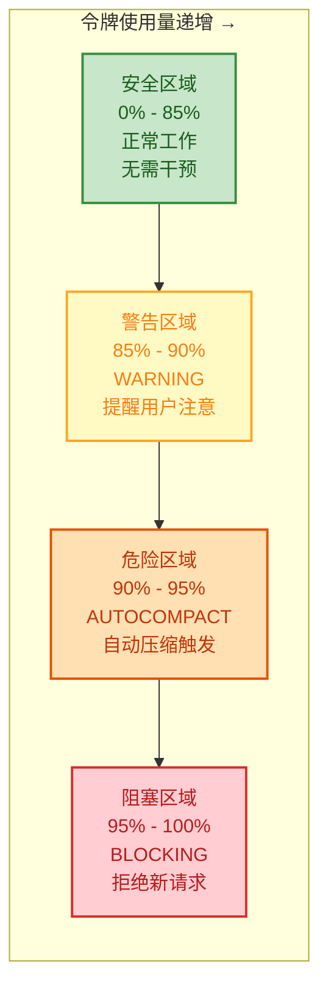
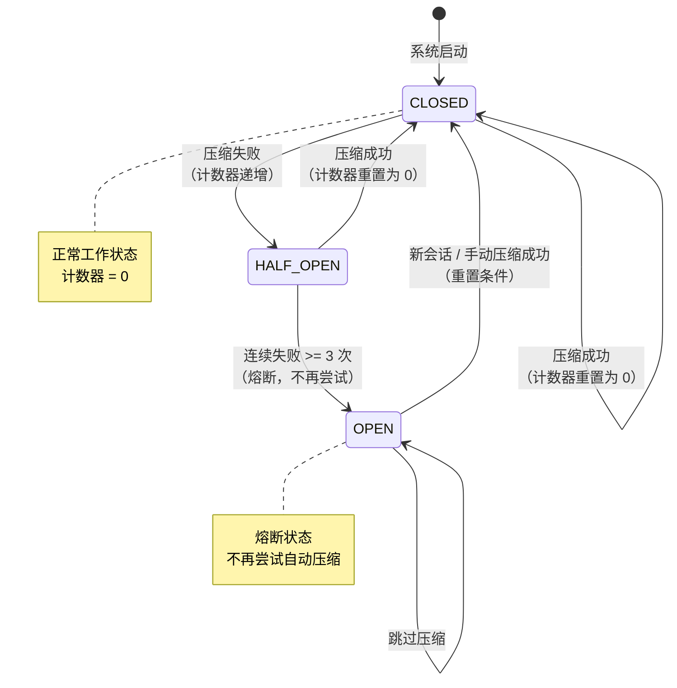
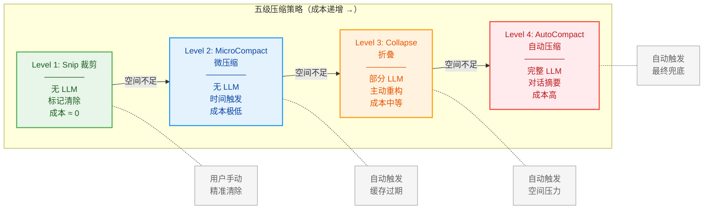
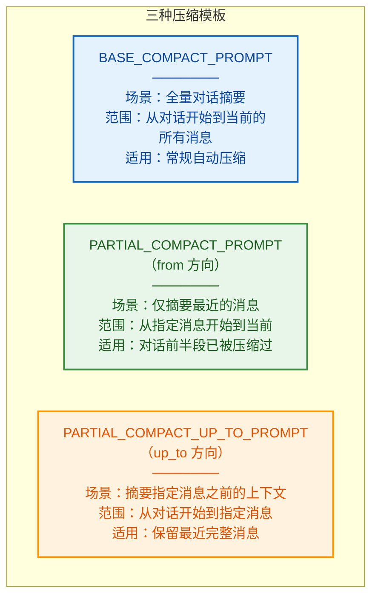
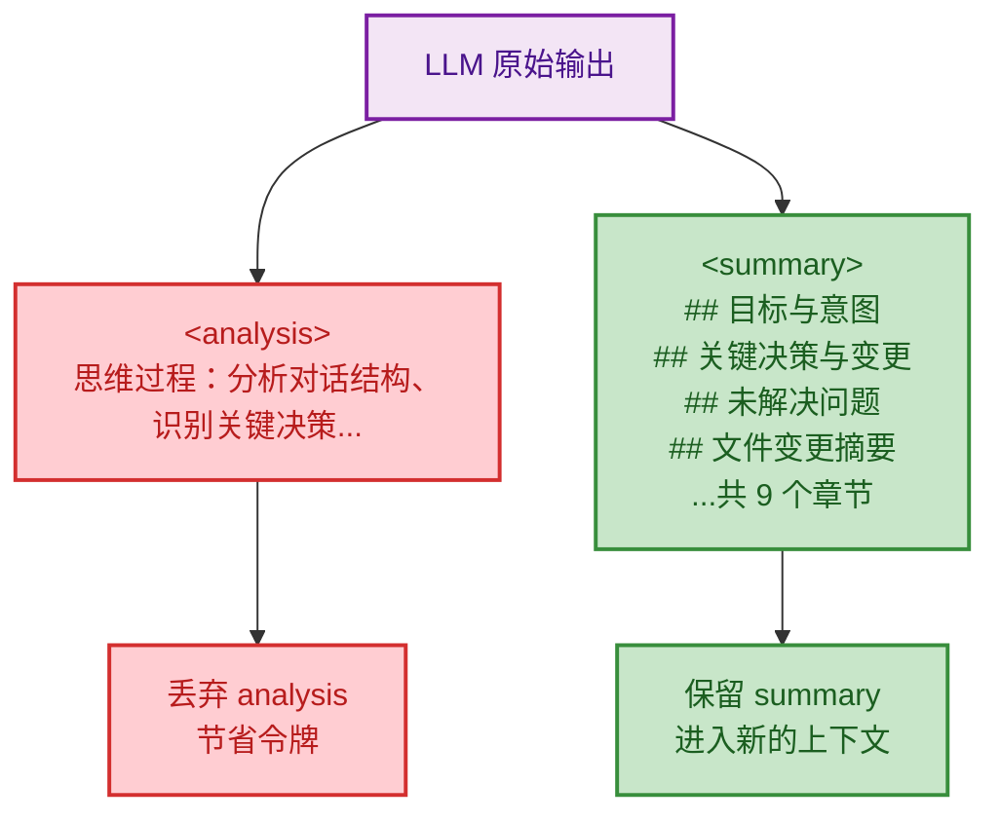
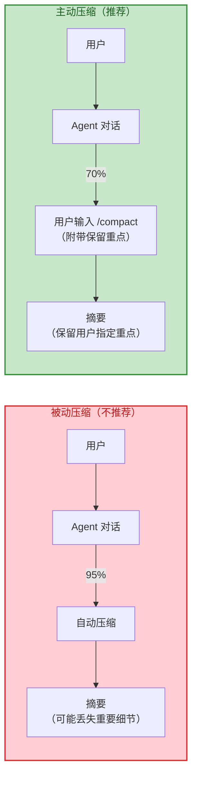

# 第7章：上下文管理 -- Agent 的工作记忆

> **学习目标：**
> 1. 理解 Agent 上下文窗口的硬约束与有效空间计算
> 2. 掌握五级渐进式压缩策略（Tool Result 预算 → Snip → MicroCompact → Collapse → AutoCompact）的设计动机与工作机制
> 3. 理解断路器模式如何保护系统免受**级联失败**（Cascading Failure——一个组件的失败导致依赖它的其他组件依次失败，形成连锁反应）
> 4. 分析压缩提示工程的双阶段输出结构
> 5. 能够为不同使用场景选择最优的上下文管理策略

---

## 7.1 上下文窗口的约束

大语言模型的一切推理能力都建立在一个前提之上：上下文窗口。Claude Code 在每一轮对话中，都需要将完整的消息历史（系统提示、用户消息、助手回复、工具调用与结果）打包发送给模型。随着对话推进，这个历史不可避免地膨胀，最终撞上模型上下文窗口的天花板。

可以把上下文窗口想象成一块**有限大小的白板**。Agent 的所有工作记忆——对话历史、工具结果、中间推理——都必须写在这块白板上。白板空间用完时，你必须擦掉旧内容才能写新内容。关键问题是：**擦掉什么、保留什么、用什么方式擦**？

这不仅是 Claude Code 面对的问题，而是所有长对话 Agent 系统都必须解决的核心工程挑战。许多 Agent 框架在这个问题上选择了"暴力截断"——直接丢弃最早的消息。Claude Code 的做法远比这精细。

### 有效窗口公式

Claude Code 用一个精确的公式来刻画真正可用于对话的空间：

```
有效窗口 = 模型窗口 - 预留输出令牌
```

在自动压缩模块中，`getEffectiveContextWindowSize` 函数实现了有效窗口大小的计算：预留模型的最大输出令牌与 20,000 令牌中的较小值，作为压缩摘要的预留空间，剩余部分才是上下文的有效承载量。

> **为什么预留 20,000 令牌？** 因为 AutoCompact（第4级压缩）需要调用 LLM 生成摘要，摘要本身也消耗输出令牌。如果不预留空间，压缩操作本身就可能因为输出空间不足而失败——一个经典的"压缩悖论"。

举个具体数字：假设模型上下文窗口为 200,000 令牌，最大输出令牌为 16,384 令牌：
- 预留空间 = min(16,384, 20,000) = 16,384 令牌
- 有效窗口 = 200,000 - 16,384 = **183,616 令牌**

这 183,616 令牌才是真正可用于承载对话历史的空间。

### 缓冲区与阈值

基于有效窗口，Claude Code 定义了多个关键阈值常量，形成一个**逐级收紧的安全网**：



| 常量 | 值 | 含义 | 设计意图 |
|------|-----|------|---------|
| `AUTOCOMPACT_BUFFER_TOKENS` | 13,000 | 自动压缩触发缓冲区 | 在用尽空间前预留安全余量，避免"边缘情况" |
| `WARNING_THRESHOLD_BUFFER_TOKENS` | 20,000 | 警告阈值缓冲区 | 早期预警，给用户留出反应时间 |
| `ERROR_THRESHOLD_BUFFER_TOKENS` | 20,000 | 错误阈值缓冲区 | 标记危险区域，触发更积极的压缩策略 |
| `MANUAL_COMPACT_BUFFER_TOKENS` | 3,000 | 手动压缩缓冲区 | 用户手动触发压缩时的最小安全余量 |

> **最佳实践：** 当你看到令牌使用量超过 80% 时，就应该考虑手动触发压缩（输入 `/compact`），而不是等到自动压缩触发。主动压缩通常能保留更多有价值的内容，因为你可以提前指导哪些信息最重要。

### 断路器设计

自动压缩并非总是成功。网络波动、API 错误或上下文本身的结构问题都可能导致压缩失败。如果盲目重试，系统会在每个轮次都发起注定失败的 API 调用，浪费大量资源。

Claude Code 引入了**断路器**（Circuit Breaker——分布式系统中的容错模式：当连续失败达到阈值后停止尝试，避免无效请求的雪崩效应）机制：当连续失败次数达到 3 次（`MAX_CONSECUTIVE_AUTOCOMPACT_FAILURES`）时，系统直接跳过后续的压缩尝试。



成功时，失败计数器重置为零；失败时，计数器递增并向上层调用者传递。这是一种经典的断路器模式 -- 连续失败达到阈值后熔断，避免雪崩效应。

**断路器引入的真实数据：** 根据工程分析，引入断路器前曾观察到 1,279 个会话出现 50 次以上的连续压缩失败（最高达 3,272 次），每天浪费约 250K 次 API 调用。引入后，这类级联失败被彻底消除。

> **反模式警告：** 如果你在构建自己的 Agent 系统，不要忽略断路器。没有断路器的系统在 API 不稳定时会陷入"压缩失败 → 重试 → 再次失败"的死循环，不仅浪费资源，还可能因为延迟增加而进一步恶化用户体验。

> **交叉参考：** 断路器模式在第 16 章构建你自己的 Agent Harness 中也会作为关键设计模式被讨论。类似的状态保护机制也出现在第 2 章的对话循环中（`max_output_tokens_recovery` 路径）。

---

## 7.2 API 请求解剖与缓存断点

在深入压缩策略之前，理解一次 API 请求的完整结构至关重要——因为压缩的每一个设计决策都受到缓存机制的约束。

### 一次 API 请求的三大支柱

每次调用 Claude API，模型都是从零开始的——它没有跨请求的持久记忆，只能看到当前请求中携带的内容。Claude Code 在每次 API 调用前，将模型需要的所有信息组装成一个完整的请求，包含三个顶级字段：

```
┌─────────────────────────────────────────────────────────────┐
│  system — 系统提示词数组（多个 TextBlock 拼接）               │
│  ┌────────────────────────────────────────────────────────┐  │
│  │ [0] 归属头 (Attribution Header)              不缓存    │  │
│  │ [1] CLI 前缀 (交互模式 / -p 模式指令)         不缓存    │  │
│  │ ─── 静态内容 ─────────────────────────── 🔒 global ── │  │
│  │ [2] 核心指令 + 工具描述 + 安全规则 + 行为准则           │  │
│  │     （所有用户完全相同）                                 │  │
│  │ ─── __SYSTEM_PROMPT_DYNAMIC_BOUNDARY__ ────────────── │  │
│  │ ─── 动态内容 ─────────────────────────── 不缓存 ───── │  │
│  │ [3] 输出风格、语言偏好、MCP 指令等                      │  │
│  │     （因用户/会话而异）                                  │  │
│  └────────────────────────────────────────────────────────┘  │
│                                                               │
│  tools — 工具 schema 数组                                     │
│  ┌────────────────────────────────────────────────────────┐  │
│  │ 内置工具 (Read, Edit, Bash, Grep, Write, Glob...)      │  │
│  │ MCP 工具 (用户安装的，可能标记 defer_loading 延迟加载)   │  │
│  │ 最后一个工具 ← 标记 cache_control 作为缓存断点          │  │
│  │ ── 断点之后 ──                                          │  │
│  │ 服务端工具 (advisor 等，开关不影响缓存)                  │  │
│  └────────────────────────────────────────────────────────┘  │
│                                                               │
│  messages — 消息数组                                          │
│  ┌────────────────────────────────────────────────────────┐  │
│  │ [User]  <system-reminder>                               │  │
│  │           CLAUDE.md 内容 + 当前日期 (会话开始时计算一次)  │  │
│  │         </system-reminder>                   (isMeta)   │  │
│  │ [User]  用户第 1 条消息                                   │  │
│  │ [Asst]  模型回复（可能包含 tool_use 块）                  │  │
│  │ [User]  tool_result 结果                                  │  │
│  │ [User]  附件消息（记忆、技能、MCP 指令等）                │  │
│  │ [Asst]  模型第 2 轮回复                                   │  │
│  │ ...（消息不断增长，直到压缩机制介入）                      │  │
│  └────────────────────────────────────────────────────────┘  │
└─────────────────────────────────────────────────────────────┘
```

### 缓存断点机制

Claude API 支持**前缀缓存**（Prefix Caching / KV Cache）：服务端记住之前处理过的前缀，后续请求只需处理新增部分，大幅降低延迟和成本。但前缀缓存有一个残酷的约束：**前缀必须字节级完全一致才能命中缓存**。任何一个字节的变化——哪怕只是换了一个工具的顺序——都会导致整个前缀的缓存失效。

为了最大化缓存命中率，Claude Code 在三个关键位置设置了缓存断点：

| 断点位置 | 缓存范围 | 作用 |
|---------|---------|------|
| 系统提示词静态/动态边界 | `global`（跨所有用户共享） | 核心指令和工具描述全球共享同一份缓存 |
| 工具 schema 数组最后一个工具 | `org`（组织内共享） | MCP 工具变化不影响之前的缓存 |
| CLAUDE.md + 日期（messages[0]） | 会话级 | 项目指令在会话内只计算一次 |

### 各组件的变化频率

| 组件 | 在请求中的位置 | 会话内变化频率 | 说明 |
|------|--------------|--------------|------|
| 核心系统指令 | `system`（边界前） | **从不** | 全局缓存，全球共享 |
| 动态系统指令 | `system`（边界后） | **从不** | 会话开始时确定 |
| 工具 schema | `tools[]` | **极少** | 延迟加载减少变动 |
| CLAUDE.md + 日期 | `messages[0]` | **从不** | 包裹在 system-reminder 中 |
| 记忆文件 | `messages`（附件） | **按需** | 相关记忆被发现时注入，去重 |
| 技能 / MCP 指令 | `messages`（附件） | **增量** | 只在列表变化时注入 delta |
| 用户消息 + 模型回复 | `messages` | **每轮增长** | 压缩机制控制增速 |

> **关键设计洞察：** 记忆、技能、MCP 指令不在系统提示词中，而是作为 `<system-reminder>` 附件消息注入到消息数组中。这样做的好处是：它们可以按需、增量地注入（只在内容变化时添加新的附件），而不会破坏系统提示词的缓存。这就是为什么很多看起来"过度设计"的机制，背后的驱动力都是缓存稳定性。

---

## 7.3 五级压缩策略

Claude Code 的上下文管理采用五级渐进式压缩策略，从低成本到高成本依次递进，每一级都在前一级不足以释放空间时才被激活。第一级（Tool Result 预算裁剪）在压缩流水线的最前面执行，对过大的工具结果进行截断或持久化到磁盘；后四级构成经典的压缩递进链。

这个设计哲学可以用一个类比来理解：**压缩策略就像衣物收纳**。你不会一上来就把所有衣服扔掉（暴力截断），而是先收起不再穿的（Snip），再压缩换季衣物（MicroCompact），然后真空封存大件（Collapse），最后才做全面整理丢弃（AutoCompact）。



### Level 1: Snip（裁剪）

Snip 是最轻量的压缩手段。它不调用任何 LLM，而是直接清除旧的工具结果内容。当用户通过 Snip 工具标记不再需要的消息时，系统将其中的工具调用结果替换为简短的标记文本（如 `[Old tool result content cleared]`），从而释放令牌空间。

在微压缩模块中可以看到这个标记文本的定义：`'[Old tool result content cleared]'`。

Snip 操作记录已释放的令牌数，传递给自动压缩判断函数，用于更准确地评估是否需要触发更高级别的压缩。

**Snip 的设计智慧：** 为什么不直接删除消息，而是替换为标记文本？因为删除消息会破坏消息链的连续性——后续消息可能引用了前面的工具调用 ID。标记文本既释放了空间，又保持了消息结构完整。

**典型使用场景：** 你刚用 Read 工具读取了 10 个文件，每个文件 500 行代码，消耗了约 15,000 令牌。这些文件内容在分析完成后就不再需要了。此时用 Snip 清除这些工具结果，立即回收大量空间。

### Level 2: MicroCompact（微压缩）

MicroCompact 是基于时间触发的大规模工具结果清理。当检测到距离上一次助手消息的时间间隔超过配置阈值时，意味着服务端缓存已过期，此时无论内容多么重要，全量重写都无法避免 -- 既然如此，不如在请求之前主动清除旧的工具结果，减小重写负载。

> **为什么与缓存过期有关？** Claude 的 API 支持提示缓存（Prompt Caching）——如果连续请求的前缀相同，缓存命中的部分可以大幅降低成本和延迟。但随着时间推移，缓存会过期。当缓存过期时，无论如何都需要重新发送完整内容。此时保留旧的工具结果只是徒增负载。

时间触发的核心逻辑在时间评估函数中：它会检查功能开关是否启用、消息来源是否为主线程，然后计算距最后一次助手消息的时间间隔。如果间隔超过配置的阈值，则触发微压缩。

触发后，系统保留最近 N 个可压缩工具结果（`config.keepRecent`，最小值为 1），将其余的工具结果内容全部替换为清除标记文本。可压缩的工具类型包括 Read、Bash、Grep、Glob、WebSearch、WebFetch、Edit 和 Write。

此外，MicroCompact 还有一个基于缓存编辑（cache editing）的路径，通过 API 层面的 `cache_edits` 机制删除工具结果而不破坏缓存前缀，这是更高级的无损优化。

**MicroCompact 的核心权衡：**

| 维度 | 说明 |
|------|------|
| **触发条件** | 距上次助手消息超过阈值时间 |
| **保留策略** | 保留最近 N 个工具结果，清除其余 |
| **成本** | 零 LLM 调用，仅字符串替换 |
| **信息损失** | 旧的工具结果内容丢失，但消息结构保留 |
| **适用场景** | 长对话中的"自然断点"（用户暂停后返回） |

### Level 3: Collapse（折叠）

Collapse 是上下文重构级压缩。当启用 Context Collapse 特性时，系统会在上下文使用率达到 90% 时开始提交（commit）压缩操作，在 95% 时阻止新的 spawn。这一级别的设计理念是将上下文管理从"被动压缩"转变为"主动重构"。

Collapse 模式会抑制自动压缩的触发，因为两者在 93% 的临界点会产生竞争。Collapse 作为更精细的上下文管理系统，拥有更高的优先级。

> **设计哲学：** Collapse 代表了一种不同的思维方式——不是"空间不够了才压缩"，而是"在空间压力出现之前就主动重构"。这类似于操作系统的内存预取策略，在内存耗尽之前就开始整理碎片。

**Collapse vs AutoCompact 的关键区别：**

| 特性 | Collapse | AutoCompact |
|------|----------|-------------|
| 触发时机 | 90% 利用率（主动） | 超过阈值（被动） |
| 压缩粒度 | 选择性重构消息组 | 全对话摘要 |
| 信息保留 | 更多原始细节 | 仅保留摘要 |
| 与 Fork 的关系 | 阻止新 spawn（95%） | 不影响 spawn |

### Level 4: AutoCompact（自动压缩）

AutoCompact 是最彻底的压缩级别 -- 调用 LLM 对完整对话进行摘要。当以上三级都无法有效释放空间，且令牌用量超过自动压缩阈值时，系统启动 AutoCompact。

这是最后的兜底手段，也是最"昂贵"的——它需要一次额外的 API 调用来生成摘要。

压缩流程由 `compactConversation` 函数驱动，其核心步骤为：

```mermaid
flowchart TD
    start["AutoCompact 触发"] --> step1["1. 执行 PreCompact 钩子"]
    step1 --> step2["2. 构建压缩提示<br/>选择模板 BASE / PARTIAL / PARTIAL_UP_TO"]
    step2 --> step3["3. 流式生成摘要<br/>通过 forked agent 或主线程调用 API"]
    step3 --> step4{"4. prompt-too-long?"}
    step4 -->|是| retry["截断最老的 API 轮次组<br/>并重试（最多 3 次）"]
    retry --> step3
    step4 -->|否| step5["5. 重建上下文<br/>CompactBoundaryMessage + 摘要 + 附件 + 钩子结果"]
    step5 --> step6["6. 执行 PostCompact 钩子"]
    step6 --> result["输出：CompactionResult"]

    classDef step fill:#e3f2fd,stroke:#1565c0,stroke-width:2px,color:#0d47a1
    classDef decision fill:#fff3e0,stroke:#ff9800,stroke-width:2px,color:#e65100
    classDef output fill:#c8e6c9,stroke:#388e3c,stroke-width:2px,color:#1b5e20

    class step1,step2,step3,step5,step6 step
    class step4 decision
    class result,output
```

`CompactionResult` 接口描述了压缩产物的完整结构，包含：边界标记（boundaryMarker）、摘要消息（summaryMessages）、重新注入的附件（attachments）、钩子结果（hookResults）、部分压缩时保留的消息（messagesToKeep），以及压缩前后的令牌计数。

值得注意的是，`buildPostCompactMessages` 函数确保了所有压缩路径的输出消息顺序一致：边界标记、摘要消息、保留消息、附件、钩子结果。

> **交叉参考：** AutoCompact 的 forked agent 执行方式与第 10 章讨论的 Fork 模式密切相关。压缩操作在一个受限的子 Agent 中执行，该子 Agent 最多运行 1 轮（只生成摘要，不做工具调用），确保压缩不会产生副作用。

> **交叉参考：** PreCompact 和 PostCompact 钩子是第 9 章钩子系统的重要应用场景。用户可以通过 PreCompact 钩子注入自定义压缩指令（如"特别保留与数据库相关的讨论"）。

---

## 7.4 压缩提示工程

压缩的质量直接取决于提示的设计。Claude Code 的压缩提示工程是一个精心设计的系统，包含多个变体和严格的输出格式约束。

可以把压缩提示想象成给一位速记员的指令：你需要明确告诉她"记什么、不记什么、用什么格式记"。如果指令不够精确，摘要要么丢失关键信息，要么塞满了不必要的细节。

### 压缩专用提示模板

压缩专用提示模块定义了三种压缩提示模板，对应三种不同的压缩场景：



每个提示都包含一个关键的防工具调用前导指令：要求模型仅以文本形式回复，不得调用任何工具（包括 Read、Bash、Grep 等）。这段指令确保摘要生成过程不会触发工具调用，因为压缩运行在受限的 forked agent 环境中（最多 1 轮），一个被拒绝的工具调用会直接导致空输出。

> **设计哲学：** 为什么压缩必须在受限环境中执行？因为压缩是对话历史的"重写"操作——如果在重写过程中又产生了新的对话历史，就会导致递归问题。限制为单轮、无工具调用，确保压缩是一个纯粹的"读取-摘要-输出"过程。

### 双阶段输出结构

压缩提示要求模型输出两个 XML 块：

- `<analysis>` 块：思维草稿本，用于组织思路、确保覆盖完整。这个块在最终结果中被丢弃。
- `<summary>` 块：正式摘要内容，包含结构化的 9 个章节。

`formatCompactSummary` 函数负责后处理：首先丢弃 `<analysis>` 块（思维草稿本），然后提取 `<summary>` 块的内容作为正式摘要。

这种设计模式值得注意：`<analysis>` 块作为 Chain-of-Thought 的载体提升了摘要质量，但不会进入最终的上下文窗口，避免浪费令牌。



**为什么双阶段设计如此重要？** 如果直接要求模型输出摘要（无 analysis 阶段），模型往往会在摘要中遗漏重要信息——因为它没有"思考"的空间。而如果保留 analysis 在上下文中，又浪费了宝贵的令牌。双阶段设计完美地解决了这个矛盾：**思考是过程，摘要是结果**。过程不计费，结果才计入上下文。

> **最佳实践：** 如果你需要在 PreCompact 钩子中自定义压缩行为，可以调整 `<summary>` 中 9 个章节的优先级。例如，如果你的工作重点是 API 设计，可以在钩子中注入指令："在摘要中特别保留所有 API 端点定义及其变更理由"。

### CompactBoundaryMessage 压缩边界标记

每次压缩完成后，系统在消息流中插入一个 `CompactBoundaryMessage`，作为压缩前后的分界线。该标记携带了压缩的元数据：触发类型（手动/自动）、压缩前令牌数、压缩涉及的消息数量。`logicalParentUuid` 字段将边界标记与压缩前的最后一条消息关联起来，构建消息链的逻辑连续性。

边界标记的存在使得后续的压缩操作能够准确识别"哪些消息已被压缩过"，避免重复压缩已摘要的内容。

> **交叉参考：** `CompactBoundaryMessage` 与第 2 章对话循环中的消息链机制直接相关。对话循环在构建 API 请求时，需要正确处理边界标记——在边界标记之前的消息已经被摘要替代，不应重复发送。

---

## 7.5 令牌预算追踪

令牌管理不仅是被动的压缩触发，还包含主动的预算规划和预警系统。

### 多级警告状态

`calculateTokenWarningState` 函数计算当前令牌使用状态，返回多个布尔标志：

| 标志 | 触发条件 | UI 行为 |
|------|---------|---------|
| `isAboveWarningThreshold` | 令牌用量 >= 阈值 - 20,000 | 显示黄色警告 |
| `isAboveErrorThreshold` | 令牌用量 >= 阈值 - 20,000 | 显示红色警告 |
| `isAboveAutoCompactThreshold` | 令牌用量 >= 自动压缩阈值 | 触发自动压缩 |
| `isAtBlockingLimit` | 令牌用量 >= 有效窗口 - 3,000 | 阻止新请求 |

这些标志驱动 UI 层面的警告展示和压缩行为的触发。`percentLeft` 字段向用户展示剩余空间的百分比。

### 压缩后的令牌预算

压缩完成后，系统并非简单地释放所有空间。压缩模块定义了严格的令牌预算常量：

| 常量 | 值 | 用途 |
|------|-----|------|
| `POST_COMPACT_MAX_FILES_TO_RESTORE` | 5 | 最多恢复的文件数量 |
| `POST_COMPACT_TOKEN_BUDGET` | 50,000 | 总令牌预算上限 |
| `POST_COMPACT_MAX_TOKENS_PER_FILE` | 5,000 | 每个文件的令牌上限 |
| `POST_COMPACT_MAX_TOKENS_PER_SKILL` | 5,000 | 每个技能的令牌上限 |
| `POST_COMPACT_SKILLS_TOKEN_BUDGET` | 25,000 | 技能独立预算 |

这些预算限制了压缩后重新注入上下文的内容量，确保了压缩不会因为过度注入附件而立即再次触发压缩。

> **反模式警告：** 常见的错误是在压缩后立即重新加载所有之前读取的文件。这样做会迅速耗尽令牌预算，导致在几轮对话后再次触发压缩，形成"压缩-膨胀-再压缩"的恶性循环。正确做法是只重新加载当前任务需要的文件。

### 真实令牌估算

`truePostCompactTokenCount` 是对压缩后上下文实际大小的估算，它包括边界标记、摘要消息、附件和钩子结果的令牌总和。这个值用于判断压缩是否会立即在下一轮触发再次压缩，为遥测提供关键的诊断信息。

如果压缩后的令牌数仍然超过自动压缩阈值，系统就知道压缩"白做了"——这种情况通常发生在对话结构极其复杂或摘要本身过长时。

---

## 7.6 长对话的上下文管理策略

理解了压缩机制后，让我们看看在实际使用中如何优化上下文管理。

### 策略一：主动压缩优于被动压缩



当你在长时间工作中感觉到对话变得冗长时，主动输入 `/compact` 并附带提示（如"/compact 保留所有数据库 schema 相关内容"），可以让压缩更有针对性。

### 策略二：分阶段工作

对于大型项目，将工作分成多个阶段：
1. **研究阶段**：读取文件、理解代码结构 → 完成后压缩
2. **规划阶段**：基于摘要制定方案 → 完成后压缩
3. **实施阶段**：基于方案执行修改 → 完成后压缩

每个阶段结束时的压缩，确保下一阶段有充足的上下文空间。

### 策略三：利用记忆系统补充上下文

> **交叉参考：** 第 6 章记忆系统是上下文管理的重要补充。压缩会丢失对话细节，但如果关键信息已经被保存为记忆文件，压缩后 Agent 仍然可以通过读取记忆恢复关键上下文。

这意味着你应该养成在重要决策时让 Agent 保存记忆的习惯——这样即使对话被压缩，关键信息也不会丢失。

### 多文件项目的上下文策略

在处理大型项目时，上下文管理尤为关键：

| 场景 | 推荐策略 |
|------|---------|
| 阅读 10+ 文件后 | 用 Snip 清除已分析完的文件内容 |
| 长时间暂停后返回 | MicroCompact 自动清除过期缓存 |
| 连续实施多个功能 | 每完成一个功能后手动压缩 |
| 跨多个子系统的重构 | 分阶段工作 + 记忆系统辅助 |

---

## 实战练习

### 练习 1：运行一个最小上下文压缩管线

以下代码实现了第 7 章的核心概念——有效窗口计算、五级压缩管线、断路器模式。复制到 `mini-compact.ts` 后用 `npx tsx mini-compact.ts` 运行。

```typescript
// mini-compact.ts — 最小上下文压缩管线（~100 行）
// 核心概念：有效窗口 + 五级压缩 + 断路器

// ── 有效窗口计算（对应 7.1 节） ────────────────────────
function getEffectiveWindow(modelWindow: number, maxOutputTokens: number): number {
  const reserved = Math.min(maxOutputTokens, 20000);
  return modelWindow - reserved;
}

// ── 压缩级别定义 ────────────────────────────────────────
interface Message { role: string; content: string; tokens: number; }

function estimateTokens(text: string): number {
  return Math.ceil(text.length / 4);  // 粗略估算：1 token ≈ 4 字符
}

// Level 0: Tool Result 预算裁剪
function toolResultBudget(messages: Message[], budget: number): Message[] {
  return messages.map(m => {
    if (m.role === "tool" && m.tokens > budget) {
      const truncated = m.content.slice(0, budget * 4) + "\n... (truncated)";
      return { ...m, content: truncated, tokens: budget };
    }
    return m;
  });
}

// Level 1: Snip — 清除旧工具结果
function snipOldResults(messages: Message[], keepRecent: number): Message[] {
  const toolMsgs = messages.filter(m => m.role === "tool");
  const nonToolMsgs = messages.filter(m => m.role !== "tool");
  const toKeep = toolMsgs.slice(-keepRecent);
  const toSnip = toolMsgs.slice(0, -keepRecent);
  const snipped = toSnip.map(m => ({
    ...m, content: "[Content snipped - re-read if needed]", tokens: 10,
  }));
  return [...snipped, ...toKeep, ...nonToolMsgs].sort((a, b) =>
    messages.indexOf(a) - messages.indexOf(b)
  );
}

// Level 4: AutoCompact — 全量摘要（用 LLM 压缩）
function autoCompact(messages: Message[]): Message[] {
  const totalTokens = messages.reduce((sum, m) => sum + m.tokens, 0);
  const summary = `[Auto-compacted: ${messages.length} messages, ~${totalTokens} tokens condensed]\n` +
    messages.slice(0, 3).map(m => `${m.role}: ${m.content.slice(0, 50)}...`).join("\n");
  return [{ role: "user", content: summary, tokens: estimateTokens(summary) }];
}

// ── 断路器（对应 7.1 节） ──────────────────────────────
class CircuitBreaker {
  private failures = 0;
  private readonly maxFailures: number;
  constructor(maxFailures = 3) { this.maxFailures = maxFailures; }
  canTry() { return this.failures < this.maxFailures; }
  recordSuccess() { this.failures = 0; }
  recordFailure() { this.failures++; }
  getState() { return this.failures >= this.maxFailures ? "OPEN" : "CLOSED"; }
}

// ── 五级压缩管线（对应 7.3 节） ────────────────────────
function compressionPipeline(
  messages: Message[],
  effectiveWindow: number,
  breaker: CircuitBreaker,
): { messages: Message[]; level: string } {
  const currentTokens = messages.reduce((sum, m) => sum + m.tokens, 0);
  const usage = currentTokens / effectiveWindow;

  // Level 0: Tool Result 预算
  if (usage > 0.5) {
    messages = toolResultBudget(messages, 500);
    const newTokens = messages.reduce((sum, m) => sum + m.tokens, 0);
    if (newTokens / effectiveWindow < 0.85) return { messages, level: "L0: Tool Result Budget" };
  }

  // Level 1: Snip
  if (usage > 0.6) {
    messages = snipOldResults(messages, 3);
    const newTokens = messages.reduce((sum, m) => sum + m.tokens, 0);
    if (newTokens / effectiveWindow < 0.85) return { messages, level: "L1: Snip" };
  }

  // Level 4: AutoCompact（带断路器）
  if (usage > 0.9 && breaker.canTry()) {
    try {
      messages = autoCompact(messages);
      breaker.recordSuccess();
      return { messages, level: "L4: AutoCompact" };
    } catch {
      breaker.recordFailure();
      return { messages, level: `L4: AutoCompact FAILED (breaker: ${breaker.getState()})` };
    }
  }

  return { messages, level: "No compression needed" };
}

// ── 主程序 ──────────────────────────────────────────────
function main() {
  const modelWindow = 200000;
  const maxOutput = 16384;
  const effectiveWindow = getEffectiveWindow(modelWindow, maxOutput);

  console.log(`模型窗口: ${modelWindow} tokens`);
  console.log(`有效窗口: ${effectiveWindow} tokens (${(effectiveWindow / modelWindow * 100).toFixed(1)}%)\n`);

  // 模拟一个逐渐膨胀的对话
  const messages: Message[] = [];
  const breaker = new CircuitBreaker(3);

  // 模拟 20 轮对话，每轮增加 ~8000 tokens
  for (let turn = 1; turn <= 20; turn++) {
    messages.push({ role: "user", content: `Turn ${turn}: Please read file_${turn}.ts`, tokens: 200 });
    messages.push({ role: "assistant", content: `I'll read file_${turn}.ts for you.`, tokens: 150 });
    messages.push({ role: "tool", content: `// file_${turn}.ts content... ${"x".repeat(30000)}`, tokens: 7500 });
    messages.push({ role: "assistant", content: `The file contains ${turn * 10} lines of code.`, tokens: 100 });

    const totalTokens = messages.reduce((sum, m) => sum + m.tokens, 0);
    const usage = totalTokens / effectiveWindow;

    if (usage > 0.5 || turn === 20) {
      const { messages: compressed, level } = compressionPipeline([...messages], effectiveWindow, breaker);
      const compressedTokens = compressed.reduce((sum, m) => sum + m.tokens, 0);
      console.log(`Turn ${turn}: ${(usage * 100).toFixed(1)}% → ${level}`);
      console.log(`  Before: ${totalTokens} tokens → After: ${compressedTokens} tokens (saved ${totalTokens - compressedTokens})`);
      console.log(`  Breaker: ${breaker.getState()}\n`);

      if (level !== "No compression needed") {
        messages.length = 0;
        messages.push(...compressed);
      }
    }
  }
}

main();
```

**运行后观察：**
- 有效窗口 = 200,000 - 16,384 = 183,616 tokens
- 五级压缩如何从轻量到重量依次触发
- 断路器如何在连续失败后停止重试
- 压缩前后 token 数量的变化

### 练习 2：令牌预算计算器

假设你的模型上下文窗口为 200,000 令牌，最大输出令牌为 16,384 令牌。请计算：
- 有效上下文窗口大小
- 自动压缩触发阈值
- 警告阈值
- 阻塞限制

> *进阶挑战：* 如果对话中包含一个消耗 50,000 令牌的系统提示，你的有效对话空间还剩多少？这对压缩策略的选择有什么影响？

### 练习 3：断路器行为分析

追踪以下事件序列中断路器状态的变化：
1. 压缩成功（consecutiveFailures = ?）
2. 压缩失败（consecutiveFailures = ?）
3. 压缩失败（consecutiveFailures = ?）
4. 压缩失败（consecutiveFailures = ?）
5. 下一轮是否尝试压缩？

> *进阶挑战：* 如果断路器阈值从 3 改为 5，在 API 故障率为 30% 的情况下，每天会多浪费多少次 API 调用？（提示：参考原文中 1,279 个会话的数据）

### 练习 4：上下文压缩实战

使用 Claude Code 开始一个长对话会话：
1. 让 Agent 连续读取 8-10 个文件
2. 观察令牌使用量的变化
3. 在使用量达到 60% 时手动输入 `/compact`，附带你希望保留的重点
4. 观察压缩前后的令牌数量对比

> *进阶挑战：* 尝试在压缩前用 Snip 工具手动清除不需要的工具结果，对比"先 Snip 再 compact"与"直接 compact"的效果差异。

---

## 关键要点

1. **有效窗口 = 模型窗口 - 预留输出令牌**：Claude Code 预留最多 20,000 令牌用于压缩摘要的输出空间，确保压缩操作本身不会因为空间不足而失败。
2. **五级渐进压缩**：Tool Result 预算裁剪 → Snip（裁剪）→ MicroCompact（微压缩）→ Collapse（折叠）→ AutoCompact（自动压缩），成本逐级递增，每一级都是前一级的"升级版"。
3. **断路器保护**：连续 3 次压缩失败后停止尝试，避免无效 API 调用的雪崩效应。这一设计源自对 1,279 个会话的实际数据分析。
4. **双阶段提示结构**：`<analysis>` 思维草稿本 + `<summary>` 正式摘要，前者在最终上下文中被丢弃以节省令牌——"思考是过程，摘要是结果"。
5. **CompactBoundaryMessage**：压缩边界标记携带元数据，通过 `logicalParentUuid` 维护消息链的逻辑连续性，使后续操作能准确识别已压缩内容。
6. **压缩后预算控制**：重新注入的内容有严格的令牌预算限制（50,000 总预算、5,000 每文件），防止压缩后立即再次触发。
7. **时间触发微压缩**：当服务端缓存过期时（距上次助手消息超时），主动清除旧工具结果，减小重写成本。
8. **主动压缩优于被动压缩**：在工作关键节点手动触发压缩并附注重点提示，比等待自动压缩能保留更多有价值的信息。
9. **记忆系统是上下文的补充**：重要决策应保存为记忆文件，这样即使对话被压缩，关键信息也不会丢失。详见第 6 章。
