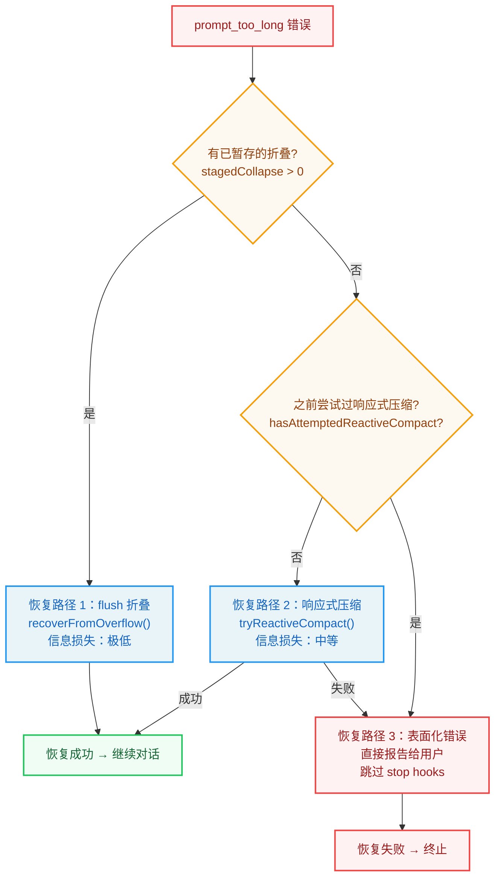
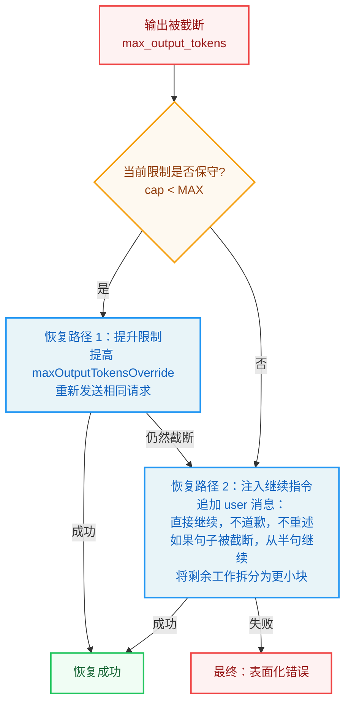
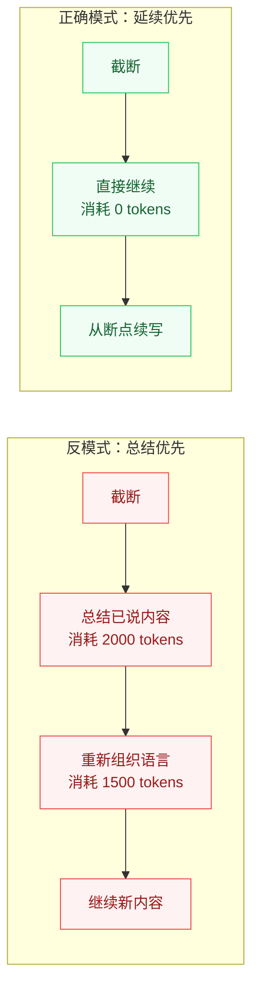
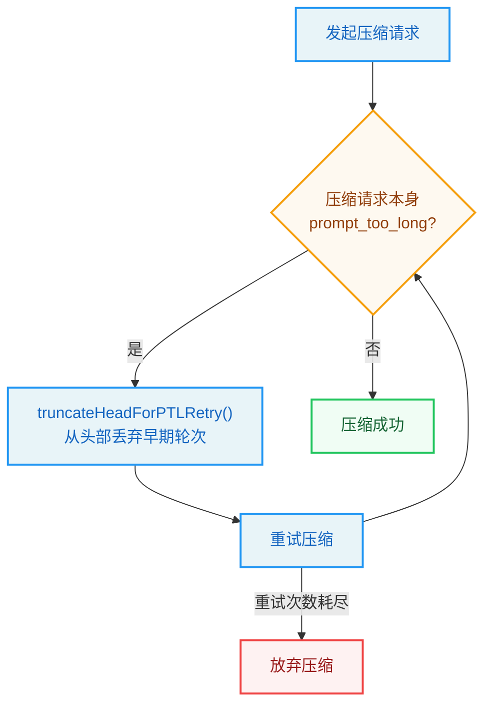
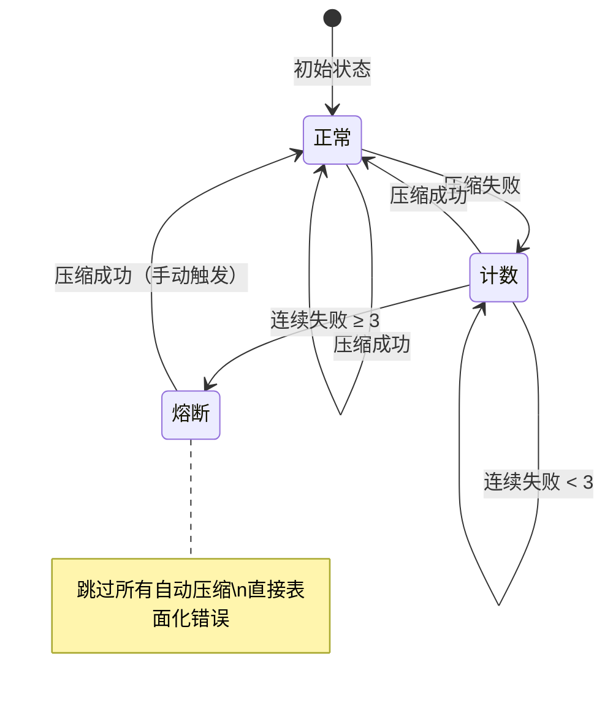
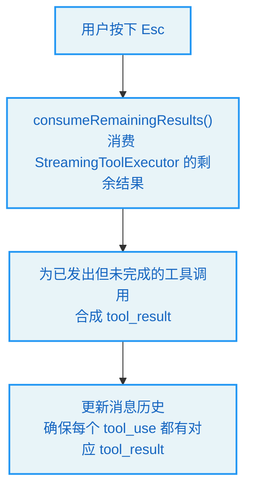

# 第 8 章 错误恢复 -- Agent 的韧性

> **学习目标：** 阅读本章后，你将能够：
>
> - 理解 Agent 系统中"错误不是异常，而是常态"的设计哲学
> - 掌握 `prompt_too_long` 的分层恢复策略（折叠 → 响应式压缩 → 表面化）
> - 理解 `max_output_tokens` 截断恢复的"延续优先"原则
> - 分析断路器模式如何防止恢复机制自身变成死循环
> - 掌握中断语义的正确处理：AbortController 与账本闭合
> - 设计可计数、可限速、可熔断的自动恢复系统

---

## 8.1 工程中最不可信的一句话："在正常条件下"

许多系统设计文档只描述"正常路径"——仿佛一个漂亮的 happy-path 流程就能让错误变成次要问题。一旦 Agent 系统进入真实运行环境，这种假设立即崩塌：模型被截断、请求超时、钩子制造循环、工具被中断、回退路径触发、恢复逻辑本身失败……

一个系统的成熟度不能用"运行顺畅时有多像人"来判断，而应该用"失败时是否仍然表现得像一个系统"来判断。Claude Code 在这个方面的优势不是假装错误很少见，而是冷静地假设：**错误是主路径的一部分，恢复必须是预设的运行时机制。**

> **设计哲学：** 普通常常遵循"先回答，错了再道歉"的模式。Harness 强调"先约束，再执行"；如果错误发生，通过恢复路径处理，而不是临场发挥。一个会道歉的系统不一定成熟；一个知道何时不该启动、何时该重试、何时该终止、以及如何准确报告失败的系统，才更接近成熟。

---

## 8.2 prompt_too_long：季节性事件，而非异常

对于长会话 Agent，`prompt_too_long` 不是边缘情况——它是一个终将到来的季节。把它当作罕见异常来处理，等于邀请生产环境来纠正你。

### 8.2.1 withheld 机制：先恢复，再报告

Claude Code 的对话循环不会立即将 `prompt_too_long` 错误展示给用户。相反，它使用一种"暂缓"（withheld）机制：某些错误被识别为可恢复类别，先交给恢复逻辑处理，只有当恢复失败后才表面化给用户。

可暂缓的错误类别包括：

| 错误类型 | 含义 | 恢复可能性 |
|---------|------|-----------|
| `prompt_too_long` | 上下文超出模型窗口 | 高（可通过压缩恢复） |
| `media_size_error` | 图片/文件过大 | 中（可截断或移除媒体） |
| `max_output_tokens` | 模型输出被截断 | 高（可提升限制或注入继续指令） |

这个设计的深层含义是：**用户通常不关心原始错误类型，只关心工作能否继续。** 如果系统能在内部恢复，就不应该打扰用户。

### 8.2.2 分层恢复：从轻量到重量

当 `prompt_too_long` 发生时，Claude Code 按照"最小信息损失"原则分层尝试恢复：



**恢复路径 1：flush 已暂存的折叠。** 上下文折叠（Context Collapse）是一种低损失的压缩策略——它将连续消息折叠为紧凑视图，保留了信息的结构。如果有已暂存但未执行的折叠操作，优先 flush 它们。这是代价最小的恢复方式。

**恢复路径 2：响应式压缩。** 如果没有已暂存的折叠，触发全量的响应式压缩（reactive compact）。这会调用 LLM 将历史对话摘要为压缩消息。信息损失中等，但能显著减少 token 数量。

**恢复路径 3：表面化错误。** 如果上述两种恢复方式都不可用或已失败，错误被表面化给用户。此时会跳过 stop hooks——因为在不可恢复的 `prompt_too_long` 状态下继续运行 stop hooks 只会导致死循环。

### 8.2.3 防死循环守卫

恢复系统最危险的失败模式是**恢复逻辑自身制造循环**：

```
error → hook 阻止 → 重试 → error → hook 阻止 → ...
```

Claude Code 通过两个机制防止这种死循环：

**守卫一：`hasAttemptedReactiveCompact` 标志。** 一旦响应式压缩已在本轮尝试过，同类型的失败不会被盲目重试。如果压缩没有帮助，再次压缩通常只是以不同姿态重放相同的失败。

**守卫二：stop hook 跳过。** 当 `prompt_too_long` 不可恢复时，系统直接表面化错误并跳过 stop hooks。在不可恢复状态下继续执行 stop hooks 只会"仪式化失败"——让系统陷入形式正确但实质无意义的重试。

> **反模式警告：** 如果你正在构建自己的 Agent 系统，确保恢复逻辑有明确的"退出条件"。一个没有退出条件的恢复系统就像一辆没有刹车的汽车——看起来还在行驶，实际上正在加速冲向悬崖。

---

## 8.3 max_output_tokens 截断：延续优先于总结

许多 LLM 产品在输出截断时会礼貌地说："抱歉，我被打断了，让我总结一下之前的内容。"这听起来很贴心，但实际帮助很小。

### 8.3.1 两阶段恢复策略

Claude Code 对 `max_output_tokens` 截断采用了"延续优先"的恢复策略：



**恢复路径 1：提升限制。** 如果当前的输出 token 限制偏保守，直接提升限制并重新发送相同请求。不注入任何元消息，不改变对话上下文——只是给模型更大的输出空间。

**恢复路径 2：注入继续指令。** 如果限制已经是最高的，或者提升后仍然截断，注入一条精心设计的 user 消息：

> 直接继续；不要道歉；不要重述；如果句子被截断，从中断处继续；将剩余工作拆分为更小的块。

这条指令的设计极为精妙：

- **"不要道歉"**：避免模型花费 token 说"抱歉我被打断了"
- **"不要重述"**：避免模型重复已经说过的内容
- **"从半句继续"**：保持输出的连贯性
- **"拆分为更小块"**：鼓励模型将剩余工作分解为多轮输出

### 8.3.2 为什么延续优于总结？

每次截断后的"总结"都会消耗额外的 token 预算，并增加语义漂移。在长任务中，这种累积效应是灾难性的：



最终，系统会把大量时间花在"总结自己"上，而非执行任务。Claude Code 明确优化了这一点：**截断后，延续就是最好的恢复。**

### 8.3.3 截断发生在工具调用块内部

一个更复杂的场景是：截断恰好发生在工具调用块内部——模型输出了 `{"name": "read` 就被截断了，工具名只输出了一半。

Claude Code 的处理方式是：这种情况产生的 `tool_use` 块是不完整的，无法被解析为有效的工具调用。系统会将其视为模型输出错误，通过上述恢复路径让模型重新生成完整的工具调用。关键在于恢复指令中"将剩余工作拆分为更小块"的指导——它鼓励模型在下一轮输出中生成更紧凑的工具调用，避免再次截断。

---

## 8.4 响应式压缩：恢复不能变成死循环机器

### 8.4.1 响应式压缩的工作机制

响应式压缩（Reactive Compact）是一种"紧急压缩"机制——当预防性压缩（Snip、Microcompact、Context Collapse）都没能阻止上下文溢出时，它作为最后手段尝试挽救对话。

工作流程：

1. 调用 LLM 将完整的历史对话摘要为一条压缩消息
2. 用压缩后的消息替换原始消息列表
3. 用新的（更短的）消息列表重新发起 API 调用

### 8.4.2 压缩自身的失败

这里存在一个经典的"压缩悖论"：如果上下文已经大到超出模型窗口，那么发送给 LLM 做摘要的请求本身也可能超出窗口——因为摘要请求需要包含完整的历史对话。

Claude Code 通过 `truncateHeadForPTLRetry()` 处理这个悖论：当压缩输入过大时，从头部开始逐块丢弃早期的 API 轮次，然后重试压缩。



这个回退是**有损的**——它可能丢弃历史信息。但它的首要目标是**避免死锁**：与其让用户卡在"无法压缩"的状态，不如优先恢复呼吸能力，再考虑历史保真度。

> **工程洞察：** 当系统窒息时，第一优先级是恢复呼吸，而不是保存高保真的历史记录。这是一个艰难但正确的工程权衡。

---

## 8.5 自动压缩断路器：恢复系统也需要治理

### 8.5.1 问题：恢复机制的无限重试

前几节讨论的是"如何恢复一次失败"。但还有一个更高层次的问题：如果恢复机制本身反复失败怎么办？

一个没有限制的自动压缩系统可能在每个轮次都发起注定失败的 API 调用，导致：

```
压缩失败 → 下一轮重试 → 压缩失败 → 下一轮重试 → ...
```

每次失败的压缩尝试都消耗 API 调用和 token 预算，最终系统在"压缩自己"上花费的资源比执行任务还多。

### 8.5.2 断路器机制

Claude Code 引入了断路器（Circuit Breaker）模式：

```typescript
// 自动压缩追踪状态
interface AutoCompactTrackingState {
  consecutiveFailures: number;  // 连续失败次数
  // ...
}

// 断路器逻辑
if (consecutiveFailures >= MAX_CONSECUTIVE_AUTOCOMPACT_FAILURES) {
  // 即使 shouldAutoCompact 返回 true，也跳过压缩
  // 直接表面化错误给用户
}
```

断路器的状态转换：



断路器的核心不变量：

```
assert consecutiveFailures < MAX_CONSECUTIVE_AUTOCOMPACT_FAILURES
    // 断路器未熔断时才执行自动压缩

assert compact_aborted_by_user ≠ summary_success
    // 用户中止压缩 ≠ 压缩成功

assert every withheld_recoverable_error surfaces iff recovery exhausted
    // 暂缓的错误必须在恢复穷尽后表面化
```

### 8.5.4 实现参考：**指数退避**（Exponential Backoff——重试策略，每次重试的等待时间按指数增长如 1s→2s→4s，避免频繁重试加重服务器负担）重试

API 调用失败时的重试是恢复系统的基础。以下是 Claude Code 采用的重试模式：

```typescript
function isRetryable(error: any): boolean {
  const status = error?.status || error?.statusCode;
  if ([429, 503, 529].includes(status)) return true;  // 限流/过载/过载
  if (error?.code === "ECONNRESET" || error?.code === "ETIMEDOUT") return true;
  if (error?.message?.includes("overloaded")) return true;
  return false;
}

async function withRetry<T>(
  fn: (signal?: AbortSignal) => Promise<T>,
  signal?: AbortSignal,
  maxRetries = 3
): Promise<T> {
  for (let attempt = 0; ; attempt++) {
    try {
      return await fn(signal);
    } catch (error: any) {
      if (signal?.aborted) throw error;        // 用户中止不重试
      if (attempt >= maxRetries || !isRetryable(error)) throw error;
      // 指数退避 + 随机抖动，避免雷群效应
      const delay = Math.min(1000 * Math.pow(2, attempt), 30000)
                    + Math.random() * 1000;
      await new Promise((r) => setTimeout(r, delay));
    }
  }
}
```

关键设计点：
- **可重试判断**：只重试限流（429）、服务不可用（503）、过载（529）和网络错误，不重试客户端错误（4xx）
- **指数退避**：`1000ms → 2000ms → 4000ms`，上限 30 秒
- **随机抖动**：`+ Math.random() * 1000` 避免多个客户端同时重试造成雷群效应
- **中止感知**：`signal?.aborted` 检查确保用户按 Ctrl+C 时立即停止重试

### 8.5.3 断路器的设计原则

**任何自动恢复必须满足三个条件：**

1. **可计数（Countable）**：记录每次恢复尝试的结果（成功/失败）
2. **可限速（Rate-limited）**：限制单位时间内的恢复尝试次数
3. **可熔断（Breakable）**：连续失败达到阈值后停止尝试

一个没有刹车的恢复系统就像一辆没有刹车的汽车——它不是在恢复，而是在加速。

---

## 8.6 中断语义：中止也是失败状态

### 8.6.1 中断不是"用户停止阅读"

许多系统将用户中断（Ctrl+C / Esc）归类为纯 UX 问题。但在运行时层面，中断是一种需要语义闭合的失败状态。

考虑这个场景：Agent 正在并行执行三个工具调用，用户按下了 Esc。此时：

- 工具 A 已完成，结果已收集
- 工具 B 正在执行，尚未返回
- 工具 C 刚刚开始

如果系统简单地"停止一切"，会发生什么？

- 工具 A 的结果会丢失（虽然已完成，但未被处理）
- 工具 B 的执行会变成孤儿进程（虽然中止了调用，但底层进程可能仍在运行）
- 工具 C 的状态不确定

### 8.6.2 账本闭合

Claude Code 的中断处理遵循"**账本闭合**"（Ledger Closure——确保每个 tool_use 都有对应 tool_result 的完整性保证，类似财务中借贷必须平衡）（Ledger Closure）原则：



关键步骤：

1. **消费剩余结果**：调用 `StreamingToolExecutor.getRemainingResults()` 获取已完成但尚未处理的工具结果
2. **合成 tool_result**：为已发出但未完成的工具调用创建合成的结果消息，标记为"被用户中止"
3. **账本闭合**：确保消息历史中每个 `tool_use` 都有对应的 `tool_result`——不多也不少

为什么这很重要？因为下一轮 API 调用会将消息历史发送给模型。如果存在没有 `tool_result` 的 `tool_use`，API 会返回协议错误。账本闭合确保了即使在中断状态下，消息历史的协议完整性也被维护。

### 8.6.3 压缩中的中断

在自动压缩过程中，用户也可能中断。Claude Code 的处理方式是：

- 将 AbortController 的 signal 传递给压缩用的 forked agent
- 捕获 `APIUserAbortError`，不将其计为成功的摘要
- 断路器的 `consecutiveFailures` 计数器不受用户中断的影响

> **关键原则：** 用户中断 ≠ 恢复失败。断路器应该区分"用户主动停止"和"系统恢复失败"——前者不应触发熔断计数。

---

## 8.7 恢复路径失败矩阵

以下矩阵总结了所有恢复路径的触发条件、前置状态和处理方式：

| 事件 | 前置状态 | 触发条件 | 下一步 | 阈值 |
|------|---------|---------|--------|------|
| PTL → 折叠 | `stagedCollapse > 0` | `prompt_too_long` | `recoverFromOverflow()` | — |
| PTL → 压缩 | `stagedCollapse = 0` | `prompt_too_long` | `tryReactiveCompact()` | 每轮最多一次 |
| PTL → 表面化 | `hasAttemptedReactiveCompact` | `prompt_too_long` | 直接报告；跳过 stop hooks | — |
| 压缩自身 PTL | 压缩输入过大 | 压缩内的 `prompt_too_long` | `truncateHeadForPTLRetry()` | 分块丢弃早期轮次 |
| MOT → 提升限制 | cap < MAX | `max_output_tokens` | 提高 `maxOutputTokensOverride` | cap ∈ {保守, 最大} |
| MOT → 注入继续 | cap = MAX | `max_output_tokens` | 追加 meta user 消息，继续 | 不重述，不道歉 |
| 自动压缩熔断 | `consecutiveFailures` ≥ 3 | 下次触发 | 跳过压缩，表面化 | `MAX_CONSECUTIVE_AUTOCOMPACT_FAILURES = 3` |
| 用户中止 | 流式执行中有待处理 `tool_use` | Esc | 消费剩余 + 合成 `tool_result` | 账本必须闭合 |

> **PTL** = prompt_too_long，**MOT** = max_output_tokens

---

## 8.8 错误处理保护执行的叙事一致性

Claude Code 恢复哲学中一个常被忽视的目标是：**保持执行的叙事一致性**——系统是否仍然能解释它尝试了什么、为什么失败、使用了什么恢复路径、以及现在是在继续、停止还是重定向。

`transition.reason`、`maxOutputTokensRecoveryCount`、`hasAttemptedReactiveCompact`、压缩边界、合成错误消息等字段的存在，正是为了保持这个叙事不被打断。它们是**抗失忆机制**。

没有叙事一致性，系统会在内部崩溃的同时继续输出文本：用户看到的是填充内容，运维看到的是 hook-retry 和 compact-retry 循环，因果链模糊不清，团队无法解释系统到底经历了什么。

恢复修复的不仅是错误，还有系统的**自我解释能力**。一旦解释能力崩溃，工程对象就退化为不透明的魔法。

---

## 8.9 断路器不变量（形式化断言）

```typescript
// 可恢复错误的集合是固定的
assert withheld_error ∈ {prompt_too_long, media_size, max_output_tokens}

// 响应式压缩每轮最多尝试一次
assert hasAttemptedReactiveCompact ⇒ skip further reactive compact

// 断路器在连续失败达到阈值后熔断
assert consecutiveFailures < MAX_CONSECUTIVE_AUTOCOMPACT_FAILURES

// 用户中止压缩 ≠ 摘要成功
assert compact_aborted_by_user ≠ summary_success

// 暂缓的错误必须在恢复穷尽后表面化
assert every withheld_recoverable_error surfaces iff recovery exhausted
```

---

## 8.10 可迁移的设计原则

本章的核心原则不仅适用于 Claude Code，任何需要长期运行的 Agent 系统都应该遵循：

1. **分层恢复而非一锤子买卖。** 优先尝试代价最小、信息损失最少的恢复方式，逐步升级。

2. **恢复逻辑必须是循环安全的。** `hasAttemptedReactiveCompact` 标志和 stop hook 跳过机制防止恢复逻辑自身制造死循环。

3. **自动恢复需要计数器和断路器。** `consecutiveFailures` 计数和 `MAX_CONSECUTIVE_AUTOCOMPACT_FAILURES` 阈值确保恢复不会无限重试。

4. **截断后，延续优于总结。** 注入继续指令而非总结请求，避免 token 浪费和语义漂移。

5. **中断是语义失败状态，需要闭合。** AbortController + 合成 tool_result + 账本闭合，确保中断后的消息历史仍然协议完整。

6. **可靠性由系统在错误后能否自我解释来证明。** transition 字段、恢复计数器、合成错误消息——这些抗失忆机制是系统可观测性的基础。

---

## 关键要点

1. **错误是主路径的一部分。** `prompt_too_long` 和 `max_output_tokens` 截断不是边缘情况，而是长会话 Agent 的结构性常态。系统必须预设恢复机制，而非临场应对。

2. **恢复必须分层。** 从 flush 折叠 → 响应式压缩 → 表面化错误，每一步都尝试代价最小的方案。"最小信息损失"是恢复策略设计的指导原则。

3. **恢复系统自身需要治理。** 断路器模式确保恢复机制不会在反复失败时消耗无限资源。任何自动恢复必须可计数、可限速、可熔断。

4. **延续优于总结。** 截断后注入继续指令而非总结请求，是 Claude Code 最务实的恢复策略之一。每次"自我总结"都在消耗预算并增加漂移。

5. **中断需要语义闭合。** 用户按 Esc 不是简单的"停止"，而是一种需要正确处理的状态转换。账本闭合确保了消息历史的协议完整性。

6. **恢复保护叙事一致性。** 好的错误处理不仅让系统"活下来"，还让系统能解释自己经历了什么。这是可观测性的基础。

---

## 实战练习

### 练习 1：运行指数退避重试与断路器

以下代码实现了第 8 章的核心概念——指数退避重试（对应 `src/agent.ts:36-61`）、断路器模式（对应 `src/services/compact/autoCompact.ts`）。复制到 `mini-recovery.ts` 后用 `npx tsx mini-recovery.ts` 运行。

> **源码参考：** 重试逻辑提取自 Claude Code `src/agent.ts` 中的 `withRetry` 函数；断路器模式对应 `autoCompact.ts` 中的 `consecutiveFailures` 计数器。

```typescript
// mini-recovery.ts — 最小错误恢复系统（~80 行）
// 源码参考：Claude Code src/agent.ts:36-61, src/services/compact/autoCompact.ts

// ── 指数退避重试（agent.ts:36-61） ───────────────────────
function isRetryable(error: any): boolean {
  const status = error?.status || error?.statusCode;
  if ([429, 503, 529].includes(status)) return true;
  if (error?.code === "ECONNRESET" || error?.code === "ETIMEDOUT") return true;
  return false;
}

async function withRetry<T>(fn: () => Promise<T>, maxRetries = 3): Promise<T> {
  for (let attempt = 0; ; attempt++) {
    try { return await fn(); }
    catch (error: any) {
      if (attempt >= maxRetries || !isRetryable(error)) throw error;
      const delay = Math.min(1000 * Math.pow(2, attempt), 30000) + Math.random() * 1000;
      console.log(`    Retry ${attempt + 1}/${maxRetries} after ${Math.round(delay)}ms (${error.message})`);
      await new Promise(r => setTimeout(r, delay));
    }
  }
}

// ── 断路器（autoCompact.ts pattern） ─────────────────────
class CircuitBreaker {
  private failures = 0;
  constructor(private maxFailures = 3) {}
  canTry() { return this.failures < this.maxFailures; }
  recordSuccess() { this.failures = 0; }
  recordFailure() { this.failures++; }
  getState() { return this.failures >= this.maxFailures ? "OPEN" : "CLOSED"; }
}

async function compactConversation(messages: string[], breaker: CircuitBreaker): Promise<string[]> {
  if (messages.length < 4) return messages;
  if (!breaker.canTry()) { console.log("    ⚡ Circuit OPEN — skipping compact"); return messages; }
  try {
    if (messages.length > 20) throw new Error("prompt_too_long");
    const summary = `[Compacted: ${messages.length} msgs → 2 msgs]`;
    breaker.recordSuccess();
    return [summary, "Understood. How can I continue?"];
  } catch (err: any) {
    breaker.recordFailure();
    console.log(`    ❌ Compact failed: ${err.message} (failures: ${breaker["failures"]})`);
    return messages;
  }
}

async function main() {
  console.log("=== 错误恢复测试 ===\n");

  console.log("1. 指数退避重试（429 限流）:");
  let callCount = 0;
  await withRetry(async () => {
    callCount++;
    if (callCount < 3) throw { status: 429, message: "rate limited" };
    return "success";
  }, 3);
  console.log(`    ✅ 第 ${callCount} 次成功\n`);

  console.log("2. 不可重试错误（400）:");
  try { await withRetry(async () => { throw { status: 400, message: "bad request" }; }); }
  catch (err: any) { console.log(`    ✅ 正确跳过重试: ${err.message}\n`); }

  console.log("3. 断路器熔断:");
  const breaker = new CircuitBreaker(3);
  for (let i = 0; i < 5; i++) await compactConversation(Array(25).fill("msg"), breaker);

  console.log("\n4. 断路器重置后恢复:");
  breaker.recordSuccess();
  await compactConversation(Array(6).fill("msg"), breaker);
  console.log("    ✅ 重置后压缩成功");
}
main();
```

### 练习 2：分析恢复路径矩阵

根据 8.7 节的恢复路径失败矩阵，为以下场景写出恢复路径：

| 场景 | 前置状态 | 触发条件 | 应走哪条路径？ |
|------|---------|---------|-------------|
| A | 有已暂存折叠 | `prompt_too_long` | ? |
| B | 无折叠，未尝试过压缩 | `prompt_too_long` | ? |
| C | 已尝试过压缩 | `prompt_too_long` | ? |
| D | 当前 cap < MAX | `max_output_tokens` | ? |
| E | 当前 cap = MAX | `max_output_tokens` | ? |

**参考答案：** A→flush 折叠；B→响应式压缩；C→表面化错误（跳过 stop hooks）；D→提升限制；E→注入继续指令。

### 练习 3：在 Claude Code 中观察恢复行为

启动 Claude Code，发送一系列大量上下文请求，观察：
1. token 使用量接近 85% 时的自动压缩触发
2. `/compact` 手动压缩前后的 token 数变化
3. 连续压缩失败时断路器的行为
