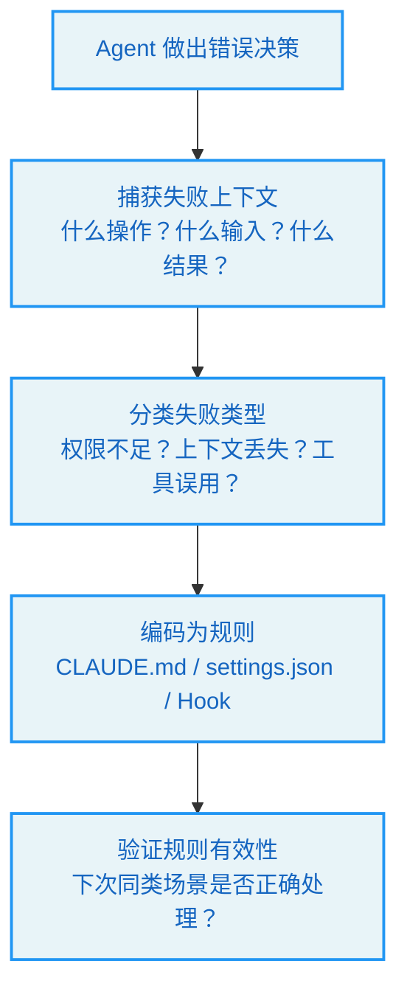

# 第 18 章 团队采纳 -- 从工具到制度

> **学习目标：** 阅读本章后，你将能够：
>
> - 识别三类典型团队画像及其主要矛盾
> - 掌握将个人经验固化为可复用制度的方法
> - 理解 CLAUDE.md / AGENTS.md 作为团队制度载体的设计哲学
> - 设计分阶段的 Agent 系统落地路线图
> - 评估"运行时灵活性"与"制度化显式性"之间的权衡

---

## 18.1 Agent 系统的团队困境

一个开发者在个人项目中使用 Claude Code，效果出色——他了解每个工具的特性，知道何时该信任 Agent、何时该介入，积累了大量隐性经验。

然后他把 Claude Code 引入团队。

一周后，问题浮现：

- 新手开发者不知道哪些操作需要人工确认，误删了生产配置
- 有人在 `.claude/settings.json` 中配置了过于宽松的权限规则，被其他人无意中继承
- 没人能说清楚"我们的 Agent 应该遵循哪些规则"——规则散落在个人配置、项目 README 和口头传授中
- 当 Agent 做出错误决策时，没有机制让团队从这次失败中学习

这些问题的根源不是技术，而是**制度**。个人经验没有被转化为团队规则，Agent 的行为边界没有被显式定义，失败没有被编码为防护机制。

> **核心洞察：** 一个团队使用 Agent 的成熟度，不取决于最强的那个人有多熟练，而取决于最弱的那个人在没有口头指导时能走多远。

---

## 18.2 三类团队画像

### 画像一：原型失控型

**特征：** 团队已经有了 Agent 原型，但长会话经常失控。

**典型症状：**
- 上下文随时间推移越来越嘈杂
- 工具调用链断裂
- 中断后状态不清晰
- 没有人能干净地关闭子智能体工作
- 验证退化为口头承诺

**主要矛盾：** 系统活不够久。不是"控制平面不够完善"，而是"系统无法在足够长的时间内保持稳定"。

**优先学习：** Claude Code 的运行时纪律——查询循环的状态管理、上下文治理、工具编排、中断处理、子智能体生命周期。

**切入建议：** 先稳定循环，再谈制度。制度美学可以等。

### 画像二：规则散乱型

**特征：** 团队已经有很多规则，但规则来源分散、权限边界不清晰。

**典型症状：**
- 本地规则散落各处
- 没人能说清哪些约束在 prompt 里、哪些在工具里
- 审批逻辑混在代码中，难以解释
- 引入多个扩展后，边界更加模糊

**主要矛盾：** 系统越来越难治理。不是"现场活不下去"，而是"系统越来越难管理"。

**优先学习：** 显式控制层——将指令、工具、策略、线程变为显式概念。

**切入建议：** 先让规则显式化，再谈运行时优化。

### 画像三：从零开始型

**特征：** 没有成熟的 Agent 系统，团队从零开始。

**这是最危险的情况。** 因为最容易犯的错误是同时羡慕两种系统的优势，构建一个失败的折中。

**更稳定的路线：**
1. 选择一个主要矛盾
2. 围绕主要矛盾设计骨架
3. 对立面只做到最低可行水平

如果第一阶段的风险主要是"模型行为失控"，从 Claude Code 意义上的运行时纪律开始。如果第一阶段的风险主要是"团队失去制度秩序"，从显式控制层开始。

**最糟糕的举动** 是试图同时完全学习两面，结果既没有稳定的主循环，也没有清晰的控制平面。

---

## 18.3 分阶段构建者检查清单

### 类型一：原型存在，长会话失控（优先学 Claude Code）

```
第 1 周：
  □ 命名循环状态集合：{messages, toolUseContext, compactTracking, turnCount}
  □ 确保每个 tool_use 都被关闭或合成填充；中止路径已连接
第 2 周：
  □ 上下文治理三件套——记忆 / 折叠 / 自动压缩阈值冻结在配置表中
  □ 验证独立于实现（验证者 ≠ 实现者）
第 3 周：
  □ 子智能体生命周期 SubagentStart/Stop 可观测
通过标准：24 小时连续会话无 token 断路器、无孤儿子智能体、无 tool_result 泄漏
```

### 类型二：规则倍增，来源分散，边界不清（优先学 Codex）

```
第 1 周：
  □ 所有指令变为片段——标记、来源、优先级三者声明
  □ 工具使用 Schema 类型化，additional_properties=false
第 2 周：
  □ 审批策略提升为规则——deny/ask/allow 独立可评估
  □ thread.id / rollout 建立；turn 级 {approvalPolicy, sandboxMode} 显式化
第 3 周：
  □ 钩子拆分为 pre/post/session_start/stop
  □ 技能资产通过指纹安装
通过标准：任何规则变更通过 PR diff 落地，无需运行时代码修改
```

### 类型三：从零开始（先选择主要矛盾）

```
第 1 周：
  □ 声明主要矛盾——"模型失控"还是"团队失序"
  □ 定义最小权限模型（高风险操作的 deny/ask 列表）
第 2 周：
  □ 在主要矛盾一侧搭建骨架（循环 OR 片段+线程，二选一）
第 3 周：
  □ 对立面仅做到最低可行（恢复路径 OR 基本钩子）
第 4 周：
  □ 落地 1-2 个技能/工具；证明循环端到端闭合
通过标准：新成员可以独立推进检查清单，无需原作者口头辅导
```

---

## 18.4 CLAUDE.md 与 AGENTS.md：制度的载体

### CLAUDE.md：本地公告板

`CLAUDE.md` 是 Claude Code 的本地规则文件。它存在于项目根目录，与记忆和技能配对，适合注册常识、禁忌和本地规则。

```
# CLAUDE.md 示例

## 项目规则
- 使用 TypeScript strict mode
- 所有 API 端点必须有输入验证
- 测试覆盖率不低于 80%

## 禁止操作
- 不要直接修改 main 分支
- 不要运行 `npm publish`
- 不要修改 .env 文件

## 代码风格
- 使用 2 空格缩进
- 优先使用 const 而非 let
- 函数不超过 50 行
```

`CLAUDE.md` 的设计哲学是"就近原则"——规则离任务目录越近，优先级越高。这确保了不同项目可以有不同的规则，而全局规则作为兜底。

### AGENTS.md：制度化表达

`AGENTS.md` 是 Codex 生态中的规则载体。与 `CLAUDE.md` 的"公告板"风格不同，`AGENTS.md` 更强调规则的**可继承性**和**作用域显式性**——即使没有 `AGENTS.md`，启用 `child_agents_md` 也会追加作用域和优先级说明。

| 特性 | CLAUDE.md | AGENTS.md |
|------|-----------|-----------|
| 风格 | 本地公告板 | 制度化文件 |
| 关注点 | 注册常识和禁忌 | 规则的适用范围和继承 |
| 与记忆的配对 | 与 memdir 配合 | 与线程/rollout 配合 |
| 适合场景 | 快速迭代的团队 | 需要明确治理边界的团队 |

### 选择建议

**选择 CLAUDE.md 如果：**
- 团队规模较小（< 10 人）
- 项目迭代速度快
- 规则变更频繁，需要快速响应
- 更重视灵活性而非显式性

**选择 AGENTS.md 风格如果：**
- 团队规模较大
- 多个项目需要共享规则
- 需要明确的规则继承和覆盖机制
- 更重视治理边界而非灵活性

---

## 18.5 个人经验如何固化为制度

### 失败编码

Agent 做出错误决策时，团队应该有机制从这次失败中学习：



**示例：** Agent 在没有确认的情况下删除了一个重要文件。

1. **捕获：** Agent 使用了 FileDeleteTool，权限模式为 auto
2. **分类：** 权限配置过于宽松
3. **编码：** 在 `settings.json` 中将 FileDeleteTool 加入 deny 列表，或配置 PreToolUse Hook 要求确认
4. **验证：** 下次 Agent 尝试删除文件时，是否正确触发了确认流程

### 成功编码

同样，成功的经验也应该被固化：

**示例：** Agent 在处理大型重构时，先读取所有相关文件再开始编辑，效果很好。

1. **捕获：** Agent 的行为模式
2. **编码：** 在 CLAUDE.md 中添加规则："进行代码重构前，先读取所有相关文件"
3. **传播：** 团队所有项目共享这条规则

### 规则生命周期


---

## 18.6 运行时灵活性 vs 制度化显式性

许多系统构建者依赖一种懒惰的虚假对立：

- 说"显式控制层"，就想象一个沉重、缓慢、僵化的系统
- 说"运行时灵活性"，就想象经验可以先撑着，结构以后再说

两者都不明智。显式性不天然僵化，灵活性不天然混乱。真正的问题是：**你是否清楚地定义了哪些东西必须显式、哪些可以留给现场判断？**

Claude Code 的优势不是拒绝结构，而是知道哪些麻烦必须在运行时面对。Codex 的优势不是拒绝灵活性，而是知道哪些边界如果不尽早声明，就会变成无休止的争论。

一个好的第三方系统不会取两者平均值——它会区分：
- 哪些规则必须先写下来
- 哪些判断可以留在运行时
- 哪些状态必须持久化
- 哪些经验只需要活在会话记忆中

> **危险的第三条路：** 许多年轻的系统两者都没做好。它们既没有硬化运行时纪律，也没有让控制层真正显式。相反，它们走了一条看起来更容易的第三条路：不断往 prompt 里塞入更多引导文件、角色描述、技能说明和工作空间文本，希望信息的丰富性能弥补骨架的脆弱。短期可行，长期必然暴露双重失败：token 烧得快，工作语义仍然不稳定。

---

## 18.7 从个人到团队的实践路径

### 阶段一：个人试验（1-2 周）

- 在个人项目中使用 Agent，积累隐性经验
- 记录"什么有效、什么无效"
- 识别高风险操作和常见失败模式

### 阶段二：规则提取（1 周）

- 从个人经验中提取可复用规则
- 编写初始 CLAUDE.md / settings.json
- 配置基本的权限规则和钩子

### 阶段三：团队试用（2-4 周）

- 选择一个低风险项目进行团队试用
- 收集团队成员的反馈
- 迭代规则配置

### 阶段四：制度化（持续）

- 建立规则评审流程（PR 审查）
- 定义规则的生命周期管理
- 建立失败编码和成功编码的机制
- 定期回顾和优化规则

---

## 关键要点

1. **Agent 团队成熟度取决于最弱环节。** 不是最强的人有多熟练，而是最弱的人在没有口头指导时能走多远。

2. **先识别主要矛盾。** "长会话失控"和"规则散乱"是两种根本不同的问题，需要不同的切入方向。

3. **规则需要载体。** CLAUDE.md 是快速迭代的公告板，AGENTS.md 是制度化的文件。选择取决于团队规模和治理需求。

4. **失败和成功都应该被编码。** 从错误中学习的机制（失败编码）和固化最佳实践的机制（成功编码）同样重要。

5. **避免"信息丰富弥补骨架脆弱"的陷阱。** 不断往 prompt 里塞内容不是制度化，是信息过载。

6. **分阶段推进。** 个人试验 → 规则提取 → 团队试用 → 制度化，每个阶段都有明确的退出标准。

---

## 实战练习

### 练习 1：运行 CLAUDE.md 加载器

以下代码实现了第 18 章的核心概念——CLAUDE.md 目录树遍历加载（对应 `src/prompt.ts:75-97`）。复制到 `mini-team.ts` 后用 `npx tsx mini-team.ts` 运行。

> **源码参考：** 提取自 Claude Code `src/prompt.ts` 中的 `loadClaudeMd()` 函数——从当前目录向上遍历目录树，收集所有 CLAUDE.md 文件。

```typescript
// mini-team.ts — 最小团队采纳工具（~60 行）
// 源码参考：Claude Code src/prompt.ts:75-97

import { existsSync, readFileSync, readdirSync } from "fs";
import { join, resolve } from "path";

// ── CLAUDE.md 加载器（prompt.ts:75-97） ──────────────────
function loadClaudeMd(dir: string): string {
  const parts: string[] = [];
  let current = dir;
  while (true) {
    const file = join(current, "CLAUDE.md");
    if (existsSync(file)) { try { parts.unshift(readFileSync(file, "utf-8")); } catch {} }
    const parent = resolve(current, "..");
    if (parent === current) break;
    current = parent;
  }
  return parts.length > 0 ? parts.join("\n---\n") : "";
}

// ── Rules 目录加载（prompt.ts:50-71） ────────────────────
function loadRulesDir(dir: string): string[] {
  const rulesDir = join(dir, ".claude", "rules");
  if (!existsSync(rulesDir)) return [];
  return readdirSync(rulesDir).filter(f => f.endsWith(".md")).map(f => {
    try { return readFileSync(join(rulesDir, f), "utf-8"); } catch { return ""; }
  }).filter(Boolean);
}

// ── 失败编码工作流 ───────────────────────────────────────
interface FailureRecord { tool: string; input: string; error: string; rule: string; }
function encodeFailure(f: FailureRecord): string {
  return `# Rule from failure\n- Tool: ${f.tool}\n- Error: ${f.error}\n- New rule: ${f.rule}`;
}

function main() {
  console.log("=== 团队采纳测试 ===\n");

  console.log("1. CLAUDE.md 加载器:");
  const claudeMd = loadClaudeMd(process.cwd());
  console.log(`  找到 ${claudeMd.split("\n").length} 行项目指令`);

  console.log("\n2. Rules 目录:");
  const rules = loadRulesDir(process.cwd());
  console.log(`  .claude/rules/ 中有 ${rules.length} 个规则文件`);

  console.log("\n3. 失败编码（将错误转化为规则）:");
  console.log(encodeFailure({ tool: "bash", input: "rm -rf node_modules", error: "Deleted wrong directory", rule: "Bash(rm -rf *) should be denied" }));

  console.log("\n4. 三类团队画像:");
  [{ t: "原型失控", s: "长会话崩溃", l: "先学 Claude Code" }, { t: "规则散乱", s: "约束来源不清", l: "先学 Codex" }, { t: "从零开始", s: "无成熟系统", l: "选一个矛盾先解决" }].forEach(a => console.log(`  ${a.t}: "${a.s}" → ${a.l}`));
}
main();
```

### 练习 2：设计你的团队配置策略

为一个 10 人团队设计配置策略，要求：
1. 团队共享权限基线（提交到 Git）
2. 个人可自定义 UI 偏好（不提交）
3. CI/CD 使用最小权限

写出 `.claude/settings.json` 和 `.claude/settings.local.json` 的内容。
